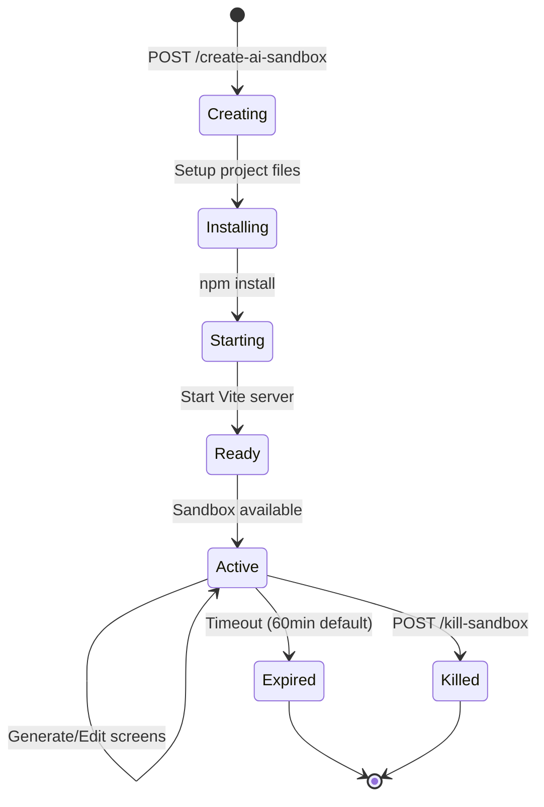

Create and initialize a new sandbox environment where AI-generated code runs with live preview. The sandbox includes a complete React + Vite + Tailwind setup.

## Endpoints

There are two versions depending on your sandbox provider:

| Endpoint | Provider | Description |
|----------|----------|-------------|
| `/api/create-ai-sandbox` | Vercel | Creates a Vercel Sandbox instance |
| `/api/create-ai-sandbox-v2` | Modal | Creates a Modal cloud sandbox (recommended) |

## Create Sandbox (Vercel)

```
POST /api/create-ai-sandbox
```

No request body required. Creates a Vercel sandbox with automatic Vite React setup.

### Response

```json
{
  "success": true,
  "sandboxId": "sbx_abc123xyz",
  "url": "https://sbx-abc123xyz.vercel.run:3000",
  "message": "Vercel sandbox created and Vite React app initialized"
}
```

## Create Sandbox V2 (Modal)

```
POST /api/create-ai-sandbox-v2
```

Creates a sandbox using the Modal cloud backend with OpenCode AI integration.

### Request Body

<ParamField body="forceNew" type="boolean" default="false">
  Force creation of a new sandbox even if one already exists.
</ParamField>

### Response

```json
{
  "success": true,
  "sandboxId": "modal-sandbox-1234",
  "url": "https://seemodo--sandbox-1234.modal.run",
  "apiUrl": "https://seemodo--sandbox-backend.modal.run",
  "message": "Modal sandbox created successfully"
}
```

## Sandbox Initialization

When a sandbox is created, it's automatically set up with:

<Steps>
  <Step title="Project Structure">
    Creates a complete Vite React project with TypeScript support.
  </Step>
  <Step title="Dependencies">
    Installs React, Tailwind CSS, and common UI dependencies.
  </Step>
  <Step title="Vite Configuration">
    Configures HMR (Hot Module Replacement) for live updates.
  </Step>
  <Step title="Dev Server">
    Starts the Vite dev server and returns the preview URL.
  </Step>
</Steps>

## Project Template

The created sandbox includes:

```
/
├── package.json          # Dependencies and scripts
├── vite.config.js        # Vite with React and HMR
├── tailwind.config.js    # Tailwind configuration
├── postcss.config.js     # PostCSS setup
├── index.html            # HTML entry point
└── src/
    ├── main.jsx          # React entry
    ├── App.tsx           # Main app component
    ├── index.css         # Tailwind imports
    └── pages/            # Generated pages go here
```

## Example Usage

```javascript
// Create a new sandbox
const response = await fetch('/api/create-ai-sandbox-v2', {
  method: 'POST',
  headers: { 'Content-Type': 'application/json' },
  body: JSON.stringify({ forceNew: false })
});

const { sandboxId, url } = await response.json();

// Now use the sandbox for generation
await fetch('/api/generate-screen', {
  method: 'POST',
  headers: { 'Content-Type': 'application/json' },
  body: JSON.stringify({
    prompt: 'A beautiful landing page',
    sandboxId: sandboxId
  })
});

// Preview is available at the returned URL
console.log('Preview:', url);
```

## Sandbox Lifecycle



## Reusing Existing Sandboxes

The API automatically reuses existing sandboxes when possible:

```javascript
// First call creates a new sandbox
await fetch('/api/create-ai-sandbox-v2', { method: 'POST' });

// Second call returns the existing sandbox
await fetch('/api/create-ai-sandbox-v2', { method: 'POST' });

// Force a new sandbox
await fetch('/api/create-ai-sandbox-v2', {
  method: 'POST',
  body: JSON.stringify({ forceNew: true })
});
```

## Error Handling

| Error | Cause | Solution |
|-------|-------|----------|
| `Sandbox creation already in progress` | Concurrent creation requests | Wait for existing creation |
| `Failed to create sandbox` | Provider error | Check provider credentials |
| `npm install failed` | Dependency issues | Retry or check template |

### Error Response

```json
{
  "error": "Failed to create sandbox",
  "details": "Modal backend not responding"
}
```

## Configuration

Sandbox behavior is configured in `config/app.config.ts`:

```typescript
modal: {
  enabled: true,
  timeoutMinutes: 60,
  defaultPort: 5173,
  workDir: '/root/vite-app'
},
vercelSandbox: {
  timeoutMinutes: 30,
  devPort: 3000,
  runtime: 'nodejs20'
}
```

## Environment Variables

| Variable | Description |
|----------|-------------|
| `MODAL_BACKEND_URL` | URL to Modal backend API |
| `VERCEL_TOKEN` | Vercel API token (for Vercel provider) |
| `VERCEL_TEAM_ID` | Vercel team ID |
| `VERCEL_PROJECT_ID` | Vercel project ID |

## Notes

- Sandboxes timeout after the configured duration (default 60 minutes)
- Modal sandboxes include OpenCode AI for intelligent code generation
- Vercel sandboxes are lighter but don't include OpenCode
- Only one sandbox is typically active at a time per session
