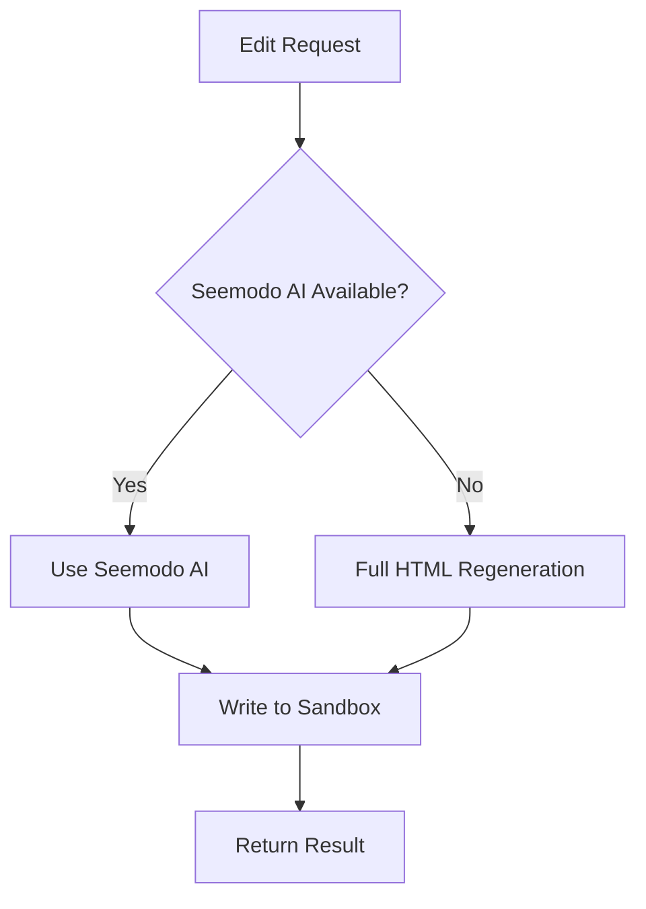

Edit an existing screen with natural language instructions. The API supports multiple strategies for applying changes efficiently.

## Endpoint

```
POST /api/edit-screen
```

## Request Body

<ParamField body="prompt" type="string" required>
  Natural language description of the changes to make.
</ParamField>

<ParamField body="currentHtml" type="string" required>
  The current HTML content of the screen to edit.
</ParamField>

<ParamField body="screenId" type="string">
  Identifier for the screen being edited.
</ParamField>

<ParamField body="sandboxId" type="string">
  Sandbox ID where the screen file should be updated.
</ParamField>

<ParamField body="pageSlug" type="string">
  Page slug of the file to update in the sandbox.
</ParamField>

<ParamField body="model" type="string" default="google/gemini-2.0-flash">
  AI model to use. Options:
  - `google/gemini-2.0-flash`
  - `anthropic/claude-sonnet-4`
  - `openai/gpt-4o`
  - `groq/llama-3.3-70b`
</ParamField>

## Example Request

```bash
curl -X POST http://app.seemodo.ai/api/edit-screen \
  -H "Content-Type: application/json" \
  -d '{
    "prompt": "Change the primary button color to blue and add a subtitle under the heading",
    "currentHtml": "<div class=\"p-4\"><h1 class=\"text-2xl\">Welcome</h1><button class=\"bg-green-500 px-4 py-2\">Get Started</button></div>",
    "sandboxId": "sandbox-abc123",
    "pageSlug": "welcome"
  }'
```

## Response

<ResponseField name="success" type="boolean">
  Whether the edit was successful.
</ResponseField>

<ResponseField name="html" type="string">
  The modified HTML content.
</ResponseField>

<ResponseField name="message" type="string">
  Description of changes applied.
</ResponseField>

<ResponseField name="changes" type="array">
  List of changes made.
</ResponseField>

<ResponseField name="sandboxUrl" type="string">
  URL to view the updated page (if sandbox was provided).
</ResponseField>

<ResponseField name="shouldReload" type="boolean">
  Whether the preview should be refreshed.
</ResponseField>

<ResponseField name="useSeemodAI" type="boolean">
  Whether Seemodo AI was used for the edit.
</ResponseField>

### Success Response

```json
{
  "success": true,
  "html": "<div class=\"p-4\"><h1 class=\"text-2xl\">Welcome</h1><p class=\"text-gray-600 mt-1\">Start your journey with us</p><button class=\"bg-blue-500 px-4 py-2\">Get Started</button></div>",
  "message": "Applied changes: Change the primary button color to blue and add a subtitle",
  "changes": ["Changed button color to blue", "Added subtitle text"],
  "sandboxUrl": "https://sandbox-abc123.modal.run/welcome",
  "shouldReload": true,
  "useSeemodAI": true
}
```

## Edit Strategies

The API uses multiple strategies in order of preference:



### Strategy 1: Seemodo AI (Preferred)

When a Modal sandbox is active, uses Seemodo AI to directly edit files:

- Reads the current file
- Applies minimal changes
- Writes back to sandbox
- HMR updates preview automatically

### Strategy 2: Full Regeneration

Fallback when Seemodo AI isn't available:

1. AI generates complete modified HTML
2. Preserves structure while applying changes
3. Result is written to sandbox

## Common Edit Examples

<Tabs>
  <Tab title="Styling">
    ```json
    {
      "prompt": "Make the card have a subtle shadow and rounded corners",
      "currentHtml": "<div class=\"border p-4\">Card content</div>"
    }
    ```
  </Tab>
  <Tab title="Content">
    ```json
    {
      "prompt": "Change the heading to 'Dashboard Overview' and update the description",
      "currentHtml": "<h1>Hello</h1><p>Welcome to the app</p>"
    }
    ```
  </Tab>
  <Tab title="Layout">
    ```json
    {
      "prompt": "Convert this to a 2-column grid layout",
      "currentHtml": "<div><div>Item 1</div><div>Item 2</div></div>"
    }
    ```
  </Tab>
  <Tab title="Add Elements">
    ```json
    {
      "prompt": "Add a search bar above the list",
      "currentHtml": "<ul><li>Item 1</li><li>Item 2</li></ul>"
    }
    ```
  </Tab>
</Tabs>

## Integration Example

```javascript
async function editScreen(prompt) {
  // Get current screen content
  const currentHtml = document.getElementById('screen-container').innerHTML;
  
  const response = await fetch('/api/edit-screen', {
    method: 'POST',
    headers: { 'Content-Type': 'application/json' },
    body: JSON.stringify({
      prompt,
      currentHtml,
      sandboxId: activeSandbox.id,
      pageSlug: currentPage.slug,
      model: 'anthropic/claude-sonnet-4'
    })
  });
  
  const result = await response.json();
  
  if (result.success && result.shouldReload) {
    // Refresh the preview iframe
    previewFrame.src = result.sandboxUrl;
  }
  
  return result;
}
```

## Best Practices

1. **Be specific** - "Change button to blue" is better than "update colors"
2. **One change at a time** - For predictable results, make focused edits
3. **Reference elements** - "The submit button" is clearer than "the button"
4. **Use Tailwind terms** - "Add shadow-lg" is precise

## Notes

- HMR automatically updates the preview when files change
- The endpoint preserves existing functionality when making visual changes
- Seemodo AI provides the most reliable edits for complex changes
