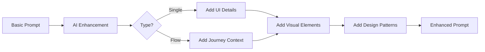

Transform a basic prompt into a detailed, professional prompt that produces better generation results.

## Endpoint

```
POST /api/enhance-prompt
```

## Request Body

<ParamField body="prompt" type="string" required>
  The basic prompt to enhance.
</ParamField>

<ParamField body="type" type="string" default="single">
  Type of enhancement:
  - `single` - Enhance for a single screen
  - `flow` - Enhance for a multi-screen flow
</ParamField>

## Example Request

```bash
curl -X POST http://localhost:3000/api/enhance-prompt \
  -H "Content-Type: application/json" \
  -d '{
    "prompt": "dashboard for analytics",
    "type": "single"
  }'
```

## Response

<ResponseField name="success" type="boolean">
  Whether the enhancement succeeded.
</ResponseField>

<ResponseField name="enhancedPrompt" type="string">
  The improved, detailed prompt.
</ResponseField>

### Success Response

```json
{
  "success": true,
  "enhancedPrompt": "A modern analytics dashboard with a dark theme featuring a top navigation bar with user profile dropdown. The main content area displays four stat cards showing key metrics (revenue, users, sessions, conversion rate) with trend indicators. Below, a large area chart visualizes data over time with gradient fill. The right sidebar shows a list of recent activities with timestamps. Use a color palette of deep navy backgrounds with bright accent colors for data visualization. Include subtle shadows and rounded corners throughout for a polished look."
}
```

## Enhancement Comparison

<Tabs>
  <Tab title="Single Screen">
    **Before:**
    ```
    login page
    ```
    
    **After:**
    ```
    A modern login page with a split layout. Left side features a gradient background 
    with the app logo and a motivational tagline. Right side contains the login form 
    with email and password inputs, a prominent "Sign In" button, and links for 
    "Forgot Password" and "Create Account". Include social login options (Google, Apple) 
    with subtle dividers. Use soft shadows, rounded input fields, and a clean sans-serif 
    typography for a professional appearance.
    ```
  </Tab>
  <Tab title="Flow">
    **Before:**
    ```
    onboarding for fitness app
    ```
    
    **After:**
    ```
    A comprehensive onboarding flow for a fitness tracking app with 4-5 connected screens.
    Start with a welcome screen featuring the app logo and a compelling tagline about 
    health transformation. Progress through feature highlights showing activity tracking, 
    workout plans, and nutrition logging. Include a personalization screen where users 
    select their fitness goals (weight loss, muscle gain, maintenance). End with account 
    creation offering email signup and social authentication. Maintain consistent branding 
    with progress indicators and smooth transitions between screens.
    ```
  </Tab>
</Tabs>

## How It Works



The AI adds:

1. **UI Elements** - Specific components like buttons, cards, forms
2. **Visual Design** - Colors, shadows, typography, spacing
3. **Layout Details** - Structure, alignment, responsive considerations
4. **Interaction Hints** - Hover states, animations, transitions
5. **Content Suggestions** - Placeholder text, icons, images

## Usage in Generation Workflow

```javascript
async function generateWithEnhancement(userPrompt) {
  // Step 1: Enhance the prompt
  const enhanceResponse = await fetch('/api/enhance-prompt', {
    method: 'POST',
    headers: { 'Content-Type': 'application/json' },
    body: JSON.stringify({ prompt: userPrompt })
  });
  
  const { enhancedPrompt } = await enhanceResponse.json();
  
  // Step 2: Generate with enhanced prompt
  const generateResponse = await fetch('/api/generate-screen', {
    method: 'POST',
    headers: { 'Content-Type': 'application/json' },
    body: JSON.stringify({
      prompt: enhancedPrompt,
      sandboxId: activeSandbox.id
    })
  });
  
  return generateResponse.json();
}
```

## Flow Enhancement

When enhancing for flows, the AI also considers:

- **Screen Count** - Optimal number of screens for the journey
- **Transitions** - How screens connect logically
- **Consistency** - Maintaining visual language across screens
- **User Journey** - Natural progression through the flow

```javascript
const response = await fetch('/api/enhance-prompt', {
  method: 'POST',
  headers: { 'Content-Type': 'application/json' },
  body: JSON.stringify({
    prompt: 'checkout process for online store',
    type: 'flow'
  })
});
```

## Error Response

```json
{
  "success": false,
  "error": "GEMINI_API_KEY is not configured"
}
```

## Configuration

The endpoint uses Google's Gemini 2.0 Flash model for fast enhancement:

```env
GEMINI_API_KEY=your-gemini-api-key
```

## Best Practices

1. **Start simple** - Let the AI add details rather than overspecifying
2. **Include context** - Mention the app type or industry for relevant suggestions
3. **Use for exploration** - Generate multiple enhancements to compare approaches
4. **Review before generating** - The enhanced prompt should match your vision
