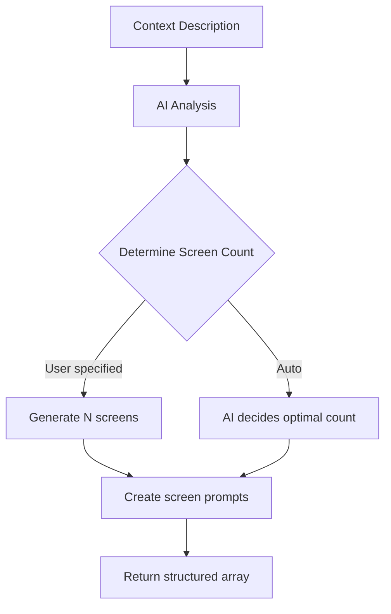

Generate a series of related screens that form a complete user flow. The AI analyzes your description and creates appropriately connected screens.

## Endpoint

```
POST /api/generate-flow
```

## Request Body

<ParamField body="context" type="string" required>
  Description of the app flow to generate. Be specific about the user journey.
</ParamField>

<ParamField body="screenCount" type="number">
  Optional exact number of screens to generate. If not specified, the AI determines the optimal count (typically 2-8 screens).
</ParamField>

<ParamField body="images" type="array">
  Array of base64-encoded reference images. The AI will match the visual style across all generated screens.
</ParamField>

## Example Request

```bash
curl -X POST http://localhost:3000/api/generate-flow \
  -H "Content-Type: application/json" \
  -d '{
    "context": "Onboarding flow for a fitness tracking app with welcome, feature highlights, goal setting, and account creation",
    "screenCount": 4
  }'
```

## Response

<ResponseField name="screens" type="array">
  Array of screen objects, each containing:
  - `name`: Short descriptive name for the screen
  - `prompt`: Detailed prompt for generating that screen
</ResponseField>

### Success Response

```json
{
  "screens": [
    {
      "name": "Welcome",
      "prompt": "FitTrack app welcome screen with logo centered, motivational tagline 'Your Fitness Journey Starts Here', background gradient in brand colors (blue to purple), large 'Get Started' button at bottom"
    },
    {
      "name": "Features",
      "prompt": "Feature highlights screen showing 3 key features with icons: Activity Tracking (steps, calories), Workout Plans (personalized routines), Progress Charts (weekly/monthly stats). 'Next' button at bottom, progress dots showing step 2 of 4"
    },
    {
      "name": "Goals",
      "prompt": "Goal setting screen with options: Lose Weight, Build Muscle, Stay Active, Improve Endurance. Each option as a selectable card with icon. 'Continue' button, allow multiple selections"
    },
    {
      "name": "Sign Up",
      "prompt": "Account creation screen with email input, password input, 'Create Account' button. Social login options (Google, Apple). Link to existing account login. Terms of service checkbox"
    }
  ]
}
```

## How It Works



## Usage with Generate Screen

The flow endpoint returns prompts that can be fed into `/generate-screen`:

```javascript
// 1. Generate the flow structure
const flowResponse = await fetch('/api/generate-flow', {
  method: 'POST',
  headers: { 'Content-Type': 'application/json' },
  body: JSON.stringify({
    context: 'E-commerce checkout flow',
    screenCount: 3
  })
});

const { screens } = await flowResponse.json();

// 2. Generate each screen
for (const screen of screens) {
  await fetch('/api/generate-screen', {
    method: 'POST',
    headers: { 'Content-Type': 'application/json' },
    body: JSON.stringify({
      prompt: screen.prompt,
      sandboxId: activeSandboxId,
      pageSlug: screen.name.toLowerCase().replace(/\s+/g, '-')
    })
  });
}
```

## Reference Images for Consistent Style

When providing reference images, the AI maintains visual consistency:

```javascript
const response = await fetch('/api/generate-flow', {
  method: 'POST',
  headers: { 'Content-Type': 'application/json' },
  body: JSON.stringify({
    context: 'Banking app onboarding flow',
    images: [
      'data:image/png;base64,iVBORw0KGgo...' // Brand reference
    ]
  })
});
```

The generated prompts will reference:
- Color schemes from the reference
- UI component styles
- Typography and spacing patterns
- Branding elements

## Example Flows

<AccordionGroup>
  <Accordion title="Onboarding Flow">
    ```json
    {
      "context": "Onboarding flow for FoodKey app - a recipe discovery app"
    }
    ```
    
    Returns 3-4 screens: Welcome, Feature highlights, Preferences, Get started
  </Accordion>
  
  <Accordion title="E-commerce Checkout">
    ```json
    {
      "context": "Checkout flow for an online clothing store with cart review, shipping, and payment"
    }
    ```
    
    Returns 3-5 screens: Cart, Shipping, Payment, Confirmation
  </Accordion>
  
  <Accordion title="Authentication Flow">
    ```json
    {
      "context": "Authentication flow with login, signup, and password recovery"
    }
    ```
    
    Returns 3-4 screens: Login, Sign up, Forgot password, Reset confirmation
  </Accordion>
  
  <Accordion title="Settings Flow">
    ```json
    {
      "context": "User settings with profile, notifications, privacy, and account management"
    }
    ```
    
    Returns 4-5 screens: Profile, Notifications, Privacy, Security, Account
  </Accordion>
</AccordionGroup>

## Best Practices

1. **Be specific** - Include app name, purpose, and key features in your context
2. **Mention transitions** - Describe how screens connect ("after login, show dashboard")
3. **Include UI hints** - Reference specific components like "cards", "tabs", "bottom navigation"
4. **Use reference images** - For consistent branding across all screens
5. **Set screen count** - When you have a specific number in mind

## Notes

- The AI automatically determines the optimal number of screens if not specified
- Simple flows (like login) may only need 1-2 screens
- Complex flows (like onboarding) may generate 5-8 screens
- Generated prompts maintain consistent naming and styling across the flow
