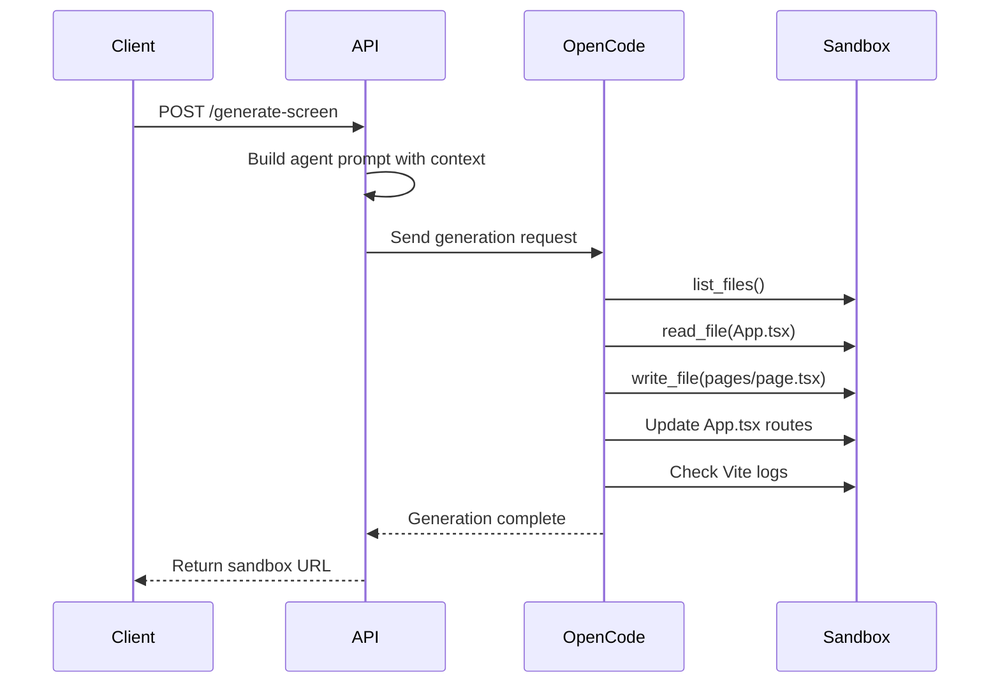

Generate a complete React screen with AI. The endpoint uses OpenCode AI to create beautiful, responsive UIs with Tailwind CSS styling.

## Endpoint

```
POST /api/generate-screen
```

## Request Body

<ParamField body="prompt" type="string" required>
  Natural language description of the screen to generate.
</ParamField>

<ParamField body="sandboxId" type="string" required>
  The ID of an active sandbox where code will be written.
</ParamField>

<ParamField body="width" type="number" default="375">
  Screen width in pixels.
</ParamField>

<ParamField body="height" type="number" default="812">
  Screen height in pixels.
</ParamField>

<ParamField body="screenType" type="string" default="Mobile">
  Type of screen: `Mobile`, `Tablet`, or `Desktop`.
</ParamField>

<ParamField body="pageSlug" type="string">
  URL slug for the generated page. Auto-generated if not provided.
</ParamField>

<ParamField body="pageType" type="string" default="normal">
  Type of page to generate:
  - `normal` - Standard single screen
  - `landingpage` - Conversion-focused landing page with multiple sections
  - `funnel` - Multi-step funnel page
</ParamField>

<ParamField body="sectionCount" type="number" default="10">
  Number of sections for landing pages and funnels.
</ParamField>

<ParamField body="images" type="array">
  Array of base64-encoded reference images to guide the design.
</ParamField>

<ParamField body="model" type="string" default="anthropic/claude-sonnet-4.5">
  AI model to use for generation. Options include:
  - `anthropic/claude-sonnet-4.5`
  - `google/gemini-2.0-flash`
  - `openai/gpt-4o`
</ParamField>

## Example Request

```bash
curl -X POST http://app.seemodo.ai/api/generate-screen \
  -H "Content-Type: application/json" \
  -d '{
    "prompt": "A modern dashboard with user stats, recent activity feed, and a sidebar navigation",
    "sandboxId": "sandbox-abc123",
    "width": 1280,
    "height": 800,
    "screenType": "Desktop",
    "pageType": "normal",
    "model": "anthropic/claude-sonnet-4.5"
  }'
```

## Response

<ResponseField name="success" type="boolean">
  Whether the generation succeeded.
</ResponseField>

<ResponseField name="sandboxUrl" type="string">
  Full URL to view the generated page in the sandbox.
</ResponseField>

<ResponseField name="pageSlug" type="string">
  The URL slug of the generated page.
</ResponseField>

<ResponseField name="agentResponse" type="string">
  Output from the AI agent describing what was created.
</ResponseField>

<ResponseField name="prompt" type="string">
  The original prompt that was processed.
</ResponseField>

<ResponseField name="useOpenCode" type="boolean">
  Indicates OpenCode AI was used for generation.
</ResponseField>

### Success Response

```json
{
  "success": true,
  "sandboxUrl": "https://sandbox-abc123.modal.run/dashboard",
  "pageSlug": "dashboard",
  "agentResponse": "Created a modern dashboard with:\n- User stats cards at the top\n- Activity feed in the center\n- Sidebar navigation on the left\n\nFiles modified:\n- src/pages/dashboard.tsx (new)\n- src/App.tsx (updated routes)",
  "prompt": "A modern dashboard with user stats...",
  "useOpenCode": true
}
```

### Error Response

```json
{
  "error": "Sandbox is required for generation. Please wait for sandbox to initialize.",
  "details": "No sandbox available"
}
```

## How It Works



## Landing Page Generation

When `pageType` is set to `landingpage`, the AI generates a high-converting landing page with structured sections:

```bash
curl -X POST http://app.seemodo.ai/api/generate-screen \
  -H "Content-Type: application/json" \
  -d '{
    "prompt": "A SaaS landing page for a project management tool",
    "sandboxId": "sandbox-abc123",
    "screenType": "Desktop",
    "pageType": "landingpage",
    "sectionCount": 8
  }'
```

The generated page will include:
- Hero section with compelling headline and CTA
- Problem/Solution section
- Features and benefits
- Social proof and testimonials
- Pricing table
- FAQ section
- Final call-to-action

## Using Reference Images

Pass base64-encoded images to guide the design:

```javascript
const imageBase64 = await convertImageToBase64(file);

const response = await fetch('/api/generate-screen', {
  method: 'POST',
  headers: { 'Content-Type': 'application/json' },
  body: JSON.stringify({
    prompt: "Recreate this design with modern styling",
    sandboxId: "sandbox-abc123",
    images: [`data:image/png;base64,${imageBase64}`]
  })
});
```

## Notes

- A sandbox must be initialized before calling this endpoint
- The endpoint writes files directly to the sandbox via OpenCode
- HMR (Hot Module Replacement) automatically updates the preview
- Do not run build commands - Vite handles everything automatically
