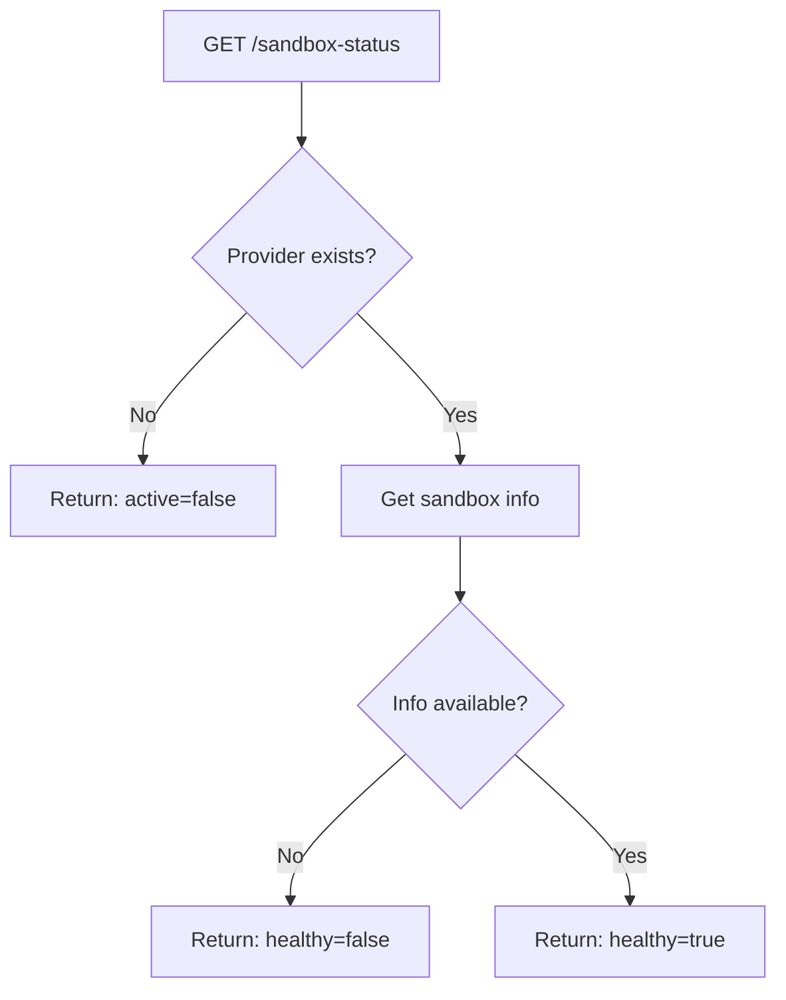

Get the current status and health information of the active sandbox.

## Endpoint

```
GET /api/sandbox-status
```

No request parameters required. Returns information about the currently active sandbox.

## Response

<ResponseField name="success" type="boolean">
  Whether the status check succeeded.
</ResponseField>

<ResponseField name="active" type="boolean">
  Whether a sandbox exists.
</ResponseField>

<ResponseField name="healthy" type="boolean">
  Whether the sandbox is responding and functional.
</ResponseField>

<ResponseField name="sandboxData" type="object">
  Detailed sandbox information:
  - `sandboxId`: Unique identifier
  - `url`: Preview URL
  - `filesTracked`: Array of known files
  - `lastHealthCheck`: Timestamp of last check
</ResponseField>

<ResponseField name="message" type="string">
  Human-readable status description.
</ResponseField>

## Example Request

```bash
curl http://app.seemodo.ai/api/sandbox-status
```

### Active and Healthy

```json
{
  "success": true,
  "active": true,
  "healthy": true,
  "sandboxData": {
    "sandboxId": "modal-sandbox-1234",
    "url": "https://seemodo--sandbox-1234.modal.run",
    "filesTracked": [
      "src/App.tsx",
      "src/main.jsx",
      "src/index.css",
      "src/pages/dashboard.tsx"
    ],
    "lastHealthCheck": "2024-01-15T10:30:00.000Z"
  },
  "message": "Sandbox is active and healthy"
}
```

### Sandbox Exists but Unhealthy

```json
{
  "success": true,
  "active": true,
  "healthy": false,
  "sandboxData": null,
  "message": "Sandbox exists but is not responding"
}
```

### No Active Sandbox

```json
{
  "success": true,
  "active": false,
  "healthy": false,
  "sandboxData": null,
  "message": "No active sandbox"
}
```

## Usage in Applications

```javascript
async function checkSandboxHealth() {
  const response = await fetch('/api/sandbox-status');
  const status = await response.json();
  
  if (!status.active) {
    // Create a new sandbox
    await createSandbox();
    return;
  }
  
  if (!status.healthy) {
    // Sandbox exists but not responding - recreate
    await killSandbox(status.sandboxData?.sandboxId);
    await createSandbox();
    return;
  }
  
  // Sandbox is ready to use
  return status.sandboxData;
}
```

## Health Check Flow



## Polling for Readiness

When waiting for a sandbox to become ready:

```javascript
async function waitForSandbox(maxAttempts = 30) {
  for (let i = 0; i < maxAttempts; i++) {
    const response = await fetch('/api/sandbox-status');
    const status = await response.json();
    
    if (status.active && status.healthy) {
      return status.sandboxData;
    }
    
    // Wait 2 seconds between checks
    await new Promise(resolve => setTimeout(resolve, 2000));
  }
  
  throw new Error('Sandbox failed to become ready');
}
```

## Related Endpoints

| Endpoint | Description |
|----------|-------------|
| `POST /api/create-ai-sandbox-v2` | Create a new sandbox |
| `GET /api/get-sandbox-files` | List files in sandbox |
| `POST /api/kill-sandbox` | Terminate the sandbox |
| `POST /api/restart-vite` | Restart the dev server |
