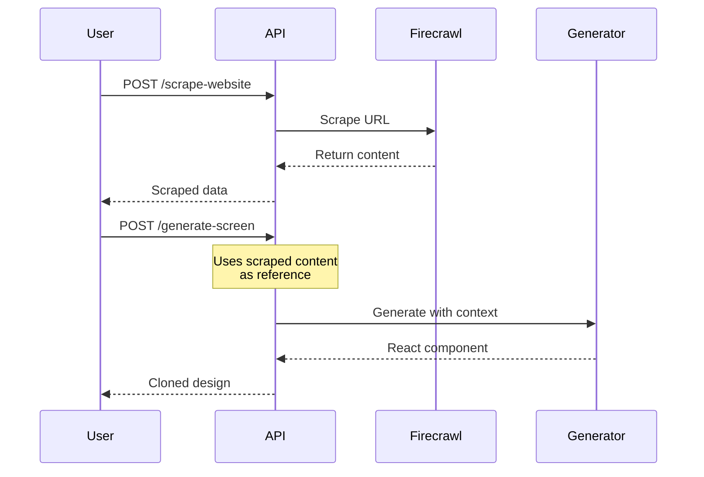

Scrape a website's content, structure, and styling to use as reference for AI generation. Powered by Firecrawl for reliable extraction.

## Endpoint

```
POST /api/scrape-website
```

## Request Body

<ParamField body="url" type="string" required>
  The URL of the website to scrape.
</ParamField>

<ParamField body="formats" type="array" default="['markdown', 'html']">
  Output formats to include:
  - `markdown` - Clean markdown content
  - `html` - Raw HTML structure
  - `screenshot` - Page screenshot (requires Firecrawl Pro)
</ParamField>

<ParamField body="options" type="object">
  Additional scraping options:
  - `onlyMainContent`: Boolean - Extract only main content (default: true)
  - `waitFor`: Number - Wait time for dynamic content in ms (default: 2000)
  - `timeout`: Number - Request timeout in ms (default: 30000)
</ParamField>

## Example Request

```bash
curl -X POST http://localhost:3000/api/scrape-website \
  -H "Content-Type: application/json" \
  -d '{
    "url": "https://example.com/landing-page",
    "formats": ["markdown", "html"],
    "options": {
      "onlyMainContent": true,
      "waitFor": 3000
    }
  }'
```

## Response

<ResponseField name="success" type="boolean">
  Whether the scrape succeeded.
</ResponseField>

<ResponseField name="data" type="object">
  Scraped content:
  - `title`: Page title
  - `description`: Meta description
  - `content`: Combined content
  - `markdown`: Markdown version
  - `html`: HTML version
  - `metadata`: Page metadata
  - `screenshot`: Base64 screenshot (if requested)
  - `links`: Extracted links
</ResponseField>

### Success Response

```json
{
  "success": true,
  "data": {
    "title": "Acme Inc - Build Better Products",
    "description": "Acme helps teams build and ship products faster.",
    "content": "# Acme Inc\n\nBuild Better Products...",
    "markdown": "# Acme Inc\n\n## Build Better Products\n\nAcme helps teams build and ship products faster with AI-powered tools.\n\n### Features\n\n- **Speed**: Ship 10x faster\n- **Quality**: AI-assisted code review\n- **Collaboration**: Real-time editing\n\n...",
    "html": "<header><nav>...</nav></header><main><h1>Acme Inc</h1>...</main>",
    "metadata": {
      "title": "Acme Inc - Build Better Products",
      "description": "Acme helps teams build and ship products faster.",
      "sourceURL": "https://example.com/landing-page",
      "statusCode": 200,
      "ogImage": "https://example.com/og-image.png"
    },
    "screenshot": null,
    "links": [
      "https://example.com/features",
      "https://example.com/pricing",
      "https://example.com/about"
    ]
  }
}
```

## Website Cloning Workflow



## Using Scraped Content for Generation

```javascript
// Step 1: Scrape the target website
const scrapeResponse = await fetch('/api/scrape-website', {
  method: 'POST',
  headers: { 'Content-Type': 'application/json' },
  body: JSON.stringify({
    url: 'https://example.com'
  })
});

const { data } = await scrapeResponse.json();

// Step 2: Generate a clone
const generateResponse = await fetch('/api/generate-screen', {
  method: 'POST',
  headers: { 'Content-Type': 'application/json' },
  body: JSON.stringify({
    prompt: `Clone this website design:\n\n${data.markdown}`,
    sandboxId: activeSandbox.id,
    screenType: 'Desktop'
  })
});
```

## Enhanced Scraping

For more detailed extraction, use the enhanced endpoint:

```
POST /api/scrape-url-enhanced
```

This provides:
- Better handling of SPAs
- CSS extraction
- Asset downloading
- Structure analysis

## Screenshot Capture

For visual reference:

```
POST /api/scrape-screenshot
```

```json
{
  "url": "https://example.com",
  "fullPage": true,
  "width": 1280,
  "height": 800
}
```

Returns a base64-encoded screenshot that can be used as a reference image.

## Error Handling

### API Key Not Configured

```json
{
  "success": true,
  "data": {
    "title": "Example Website",
    "content": "This is a mock response for https://example.com. Configure FIRECRAWL_API_KEY to enable real scraping.",
    "markdown": "# Example Website\n\nThis is mock content for demonstration purposes."
  }
}
```

### Scrape Failed

```json
{
  "success": false,
  "error": "Failed to scrape website",
  "data": {
    "title": "Error",
    "markdown": "# Error\n\nConnection timeout while fetching the page."
  }
}
```

## Configuration

```env
FIRECRAWL_API_KEY=your-firecrawl-api-key
```

Get an API key at [firecrawl.dev](https://firecrawl.dev).

## Limitations

- Some websites block automated scraping
- JavaScript-heavy SPAs may not render completely
- Rate limits apply based on your Firecrawl plan
- Screenshots require Firecrawl Pro

## Best Practices

1. **Use `onlyMainContent`** - Excludes headers/footers for cleaner content
2. **Increase `waitFor`** - For dynamic content, wait longer
3. **Combine with screenshots** - Visual reference improves generation
4. **Check the markdown** - Verify important content was captured
