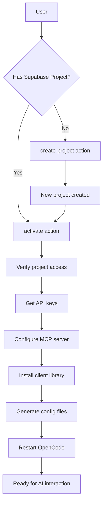

Connect your sandbox to Supabase for database, authentication, and storage capabilities. The AI can then directly interact with your backend.

## Endpoint

```
POST /api/seemodo-cloud
```

## Authentication

All requests require a Supabase API token in the header:

```bash
-H "X-Supabase-Token: your-supabase-access-token"
```

Get your access token from: Supabase Dashboard → Account → Access Tokens

## Actions

The endpoint supports three actions:

| Action | Description |
|--------|-------------|
| `activate` | Connect a Supabase project to the sandbox |
| `create-project` | Create a new Supabase project |
| `status` | Check connection status |

---

## Activate Cloud

Connect an existing Supabase project to your sandbox.

### Request Body

<ParamField body="action" type="string" required>
  Must be `"activate"`
</ParamField>

<ParamField body="projectRef" type="string" required>
  Your Supabase project reference ID (e.g., `abcdefghijklmnop`).
</ParamField>

<ParamField body="sandboxId" type="string" required>
  The ID of the active sandbox.
</ParamField>

<ParamField body="sandboxApiUrl" type="string" required>
  The API URL of the sandbox backend.
</ParamField>

### Example Request

```bash
curl -X POST http://app.seemodo.ai/api/seemodo-cloud \
  -H "Content-Type: application/json" \
  -H "X-Supabase-Token: sbp_your_token_here" \
  -d '{
    "action": "activate",
    "projectRef": "abcdefghijklmnop",
    "sandboxId": "modal-sandbox-1234",
    "sandboxApiUrl": "https://seemodo--sandbox-backend.modal.run"
  }'
```

### Success Response

```json
{
  "success": true,
  "project": {
    "ref": "abcdefghijklmnop",
    "name": "My Project",
    "region": "eu-central-1",
    "endpoint": "https://abcdefghijklmnop.supabase.co"
  },
  "apiKeys": {
    "anon": "eyJhbGciOiJIUzI1NiIsInR5cCI6IkpXVCJ9...",
    "service_role": "eyJhbGciOiJIUzI1NiIsInR5cCI6IkpXVCJ9..."
  },
  "mcpServerName": "supabase_abcdefghijklmnop",
  "mcpAuthUrl": null,
  "mcpAuthNeeded": false
}
```

### What Activation Does

<Steps>
  <Step title="Verify Project">
    Confirms you have access to the Supabase project.
  </Step>
  <Step title="Get API Keys">
    Retrieves anon and service_role keys.
  </Step>
  <Step title="Configure MCP">
    Sets up the Supabase MCP server in OpenCode.
  </Step>
  <Step title="Install Client">
    Adds `@supabase/supabase-js` to the sandbox.
  </Step>
  <Step title="Create Config">
    Generates `src/lib/supabase.ts` with connection details.
  </Step>
  <Step title="Add Rules">
    Copies Supabase best practice rules for the AI.
  </Step>
</Steps>

---

## Create Project

Create a new Supabase project.

### Request Body

<ParamField body="action" type="string" required>
  Must be `"create-project"`
</ParamField>

<ParamField body="name" type="string" required>
  Name for the new project.
</ParamField>

<ParamField body="organizationId" type="string" required>
  Your Supabase organization ID.
</ParamField>

### Example Request

```bash
curl -X POST http://app.seemodo.ai/api/seemodo-cloud \
  -H "Content-Type: application/json" \
  -H "X-Supabase-Token: sbp_your_token_here" \
  -d '{
    "action": "create-project",
    "name": "My New App",
    "organizationId": "org-abc123"
  }'
```

### Success Response

```json
{
  "success": true,
  "projectRef": "newprojectref123",
  "project": {
    "ref": "newprojectref123",
    "name": "My New App",
    "region": "eu-central-1",
    "endpoint": "https://newprojectref123.supabase.co"
  }
}
```

---

## Check Status

Check if a project is connected and accessible.

### Request Body (POST)

```json
{
  "action": "status",
  "projectRef": "abcdefghijklmnop"
}
```

### Query Parameters (GET)

```
GET /api/seemodo-cloud?projectRef=abcdefghijklmnop
```

### Success Response

```json
{
  "activated": true,
  "project": {
    "ref": "abcdefghijklmnop",
    "name": "My Project",
    "status": "ACTIVE_HEALTHY",
    "region": "eu-central-1"
  }
}
```

---

## Files Created in Sandbox

After activation, these files are created:

### `/src/lib/supabase.ts`

```typescript
import { createClient } from '@supabase/supabase-js';

const supabaseUrl = 'https://abcdefghijklmnop.supabase.co';
const supabaseAnonKey = 'eyJhbGciOiJIUzI1NiIs...';

export const supabase = createClient(supabaseUrl, supabaseAnonKey);
```

### `/AGENTS.md`

Contains instructions for the AI about:
- Using pnpm (not npm)
- Supabase configuration details
- MCP server usage examples
- Best practices for database, auth, storage

### `/.opencode/opencode.json`

Configures the Supabase MCP server for direct database access.

---

## Using with AI

After activation, you can ask the AI to:

```
Create a users table with id, email, name, and created_at columns.
Add RLS policies so users can only read their own data.
```

```
Set up authentication with email/password and Google OAuth.
```

```
Create a storage bucket for user avatars with size limits.
```

The AI uses the MCP server to execute these directly on Supabase.

---

## Error Responses

### Invalid Token

```json
{
  "message": "API token required"
}
```

### Project Not Found

```json
{
  "message": "Project not found or access denied"
}
```

### Setup Failed

```json
{
  "message": "Failed to set up Supabase in sandbox: Connection refused"
}
```

---

## Flow Diagram



## Related

- [Seemodo Cloud Guide](/seemodo/cloud) - Complete cloud integration documentation
- [Architecture](/seemodo/architecture) - System architecture overview
