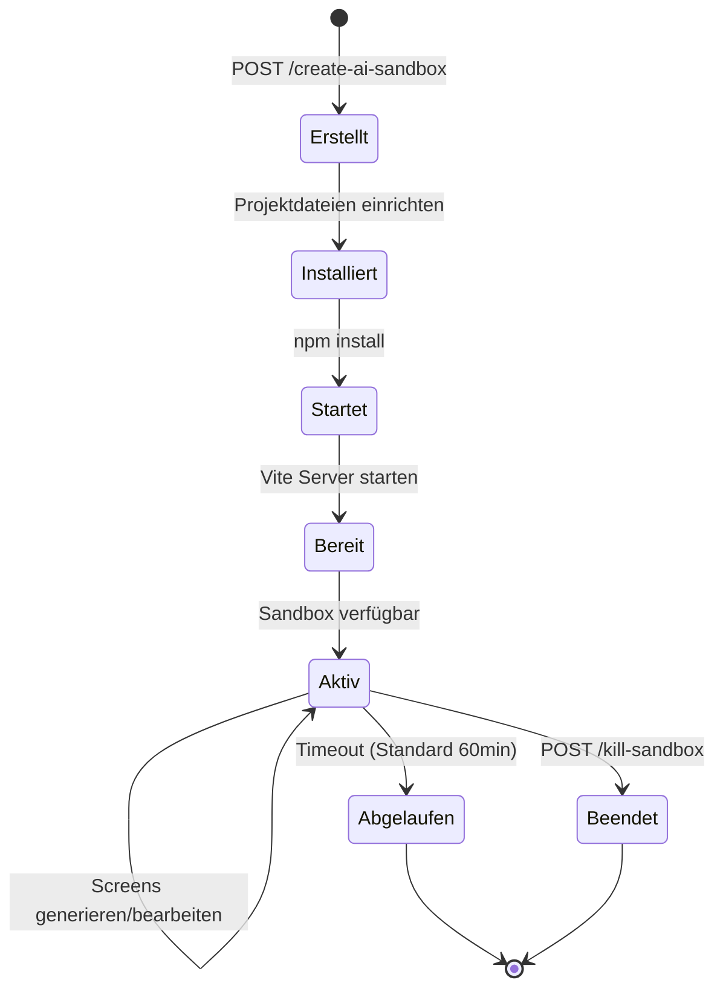

Erstelle und initialisiere eine neue Sandbox-Umgebung in der KI-generierter Code mit Live-Vorschau läuft. Die Sandbox beinhaltet ein komplettes React + Vite + Tailwind Setup.

## Endpunkte

Es gibt zwei Versionen je nach Sandbox-Provider:

| Endpunkt | Provider | Beschreibung |
|----------|----------|--------------|
| `/api/create-ai-sandbox` | Vercel | Erstellt eine Vercel Sandbox-Instanz |
| `/api/create-ai-sandbox-v2` | Modal | Erstellt eine Modal Cloud-Sandbox (empfohlen) |

## Sandbox erstellen (Vercel)

```
POST /api/create-ai-sandbox
```

Kein Request Body erforderlich. Erstellt eine Vercel-Sandbox mit automatischem Vite React Setup.

### Antwort

```json
{
  "success": true,
  "sandboxId": "sbx_abc123xyz",
  "url": "https://sbx-abc123xyz.vercel.run:3000",
  "message": "Vercel-Sandbox erstellt und Vite React App initialisiert"
}
```

## Sandbox V2 erstellen (Modal)

```
POST /api/create-ai-sandbox-v2
```

Erstellt eine Sandbox mit dem Modal Cloud-Backend mit Seemodo AI-Integration.

### Request Body

<ParamField body="forceNew" type="boolean" default="false">
  Erstellung einer neuen Sandbox erzwingen auch wenn bereits eine existiert.
</ParamField>

### Antwort

```json
{
  "success": true,
  "sandboxId": "modal-sandbox-1234",
  "url": "https://seemodo--sandbox-1234.modal.run",
  "apiUrl": "https://seemodo--sandbox-backend.modal.run",
  "message": "Modal-Sandbox erfolgreich erstellt"
}
```

## Sandbox-Initialisierung

Wenn eine Sandbox erstellt wird, wird automatisch eingerichtet:

<Steps>
  <Step title="Projektstruktur">
    Erstellt ein komplettes Vite React-Projekt mit TypeScript-Unterstützung.
  </Step>
  <Step title="Dependencies">
    Installiert React, Tailwind CSS und gängige UI-Dependencies.
  </Step>
  <Step title="Vite-Konfiguration">
    Konfiguriert HMR (Hot Module Replacement) für Live-Updates.
  </Step>
  <Step title="Dev Server">
    Startet den Vite Dev-Server und gibt die Vorschau-URL zurück.
  </Step>
</Steps>

## Projekt-Template

Die erstellte Sandbox beinhaltet:

```
/
├── package.json          # Dependencies und Scripts
├── vite.config.js        # Vite mit React und HMR
├── tailwind.config.js    # Tailwind-Konfiguration
├── postcss.config.js     # PostCSS Setup
├── index.html            # HTML-Einstiegspunkt
└── src/
    ├── main.jsx          # React-Einstieg
    ├── App.tsx           # Haupt-App-Komponente
    ├── index.css         # Tailwind-Imports
    └── pages/            # Generierte Seiten kommen hierhin
```

## Beispiel-Verwendung

```javascript
// Neue Sandbox erstellen
const response = await fetch('/api/create-ai-sandbox-v2', {
  method: 'POST',
  headers: { 'Content-Type': 'application/json' },
  body: JSON.stringify({ forceNew: false })
});

const { sandboxId, url } = await response.json();

// Jetzt Sandbox für Generierung nutzen
await fetch('/api/generate-screen', {
  method: 'POST',
  headers: { 'Content-Type': 'application/json' },
  body: JSON.stringify({
    prompt: 'Eine schöne Landing Page',
    sandboxId: sandboxId
  })
});

// Vorschau ist unter zurückgegebener URL verfügbar
console.log('Vorschau:', url);
```

## Sandbox-Lebenszyklus



## Bestehende Sandboxes wiederverwenden

Die API verwendet automatisch bestehende Sandboxes wenn möglich:

```javascript
// Erster Aufruf erstellt neue Sandbox
await fetch('/api/create-ai-sandbox-v2', { method: 'POST' });

// Zweiter Aufruf gibt bestehende Sandbox zurück
await fetch('/api/create-ai-sandbox-v2', { method: 'POST' });

// Neue Sandbox erzwingen
await fetch('/api/create-ai-sandbox-v2', {
  method: 'POST',
  body: JSON.stringify({ forceNew: true })
});
```

## Fehlerbehandlung

| Fehler | Ursache | Lösung |
|--------|---------|--------|
| `Sandbox-Erstellung läuft bereits` | Gleichzeitige Erstellungs-Anfragen | Auf bestehende Erstellung warten |
| `Sandbox-Erstellung fehlgeschlagen` | Provider-Fehler | Provider-Credentials prüfen |
| `npm install fehlgeschlagen` | Dependency-Probleme | Erneut versuchen oder Template prüfen |

### Fehler-Antwort

```json
{
  "error": "Sandbox-Erstellung fehlgeschlagen",
  "details": "Modal-Backend antwortet nicht"
}
```

## Konfiguration

Sandbox-Verhalten wird in `config/app.config.ts` konfiguriert:

```typescript
modal: {
  enabled: true,
  timeoutMinutes: 60,
  defaultPort: 5173,
  workDir: '/root/vite-app'
},
vercelSandbox: {
  timeoutMinutes: 30,
  devPort: 3000,
  runtime: 'nodejs20'
}
```

## Umgebungsvariablen

| Variable | Beschreibung |
|----------|--------------|
| `MODAL_BACKEND_URL` | URL zum Modal Backend-API |
| `VERCEL_TOKEN` | Vercel API-Token (für Vercel-Provider) |
| `VERCEL_TEAM_ID` | Vercel Team-ID |
| `VERCEL_PROJECT_ID` | Vercel Projekt-ID |

## Hinweise

- Sandboxes haben Timeout nach konfigurierter Dauer (Standard 60 Minuten)
- Modal-Sandboxes beinhalten Seemodo AI für intelligente Code-Generierung
- Vercel-Sandboxes sind leichter aber ohne Seemodo AI
- Typisch ist nur eine Sandbox pro Session aktiv
