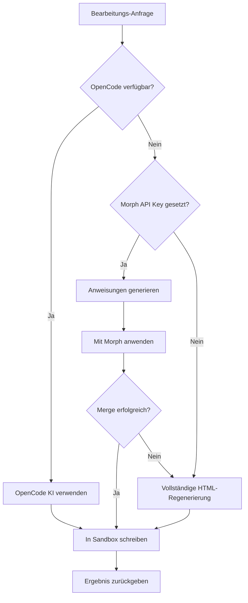

Bearbeite einen bestehenden Screen mit natürlichsprachlichen Anweisungen. Die API unterstützt mehrere Strategien für effiziente Änderungsanwendung.

## Endpunkt

```
POST /api/edit-screen
```

## Request Body

<ParamField body="prompt" type="string" required>
  Natürlichsprachliche Beschreibung der vorzunehmenden Änderungen.
</ParamField>

<ParamField body="currentHtml" type="string" required>
  Der aktuelle HTML-Inhalt des zu bearbeitenden Screens.
</ParamField>

<ParamField body="screenId" type="string">
  Identifikator für den bearbeiteten Screen.
</ParamField>

<ParamField body="sandboxId" type="string">
  Sandbox-ID wo die Screen-Datei aktualisiert werden soll.
</ParamField>

<ParamField body="pageSlug" type="string">
  Seiten-Slug der zu aktualisierenden Datei in der Sandbox.
</ParamField>

<ParamField body="model" type="string" default="google/gemini-2.0-flash">
  KI-Modell zur Verwendung. Optionen:
  - `google/gemini-2.0-flash`
  - `anthropic/claude-sonnet-4`
  - `openai/gpt-4o`
  - `groq/llama-3.3-70b`
</ParamField>

## Beispiel-Anfrage

```bash
curl -X POST http://app.seemodo.ai/api/edit-screen \
  -H "Content-Type: application/json" \
  -d '{
    "prompt": "Ändere die Primär-Button-Farbe zu blau und füge einen Untertitel unter der Überschrift hinzu",
    "currentHtml": "<div class=\"p-4\"><h1 class=\"text-2xl\">Willkommen</h1><button class=\"bg-green-500 px-4 py-2\">Los geht'\''s</button></div>",
    "sandboxId": "sandbox-abc123",
    "pageSlug": "welcome"
  }'
```

## Antwort

<ResponseField name="success" type="boolean">
  Ob die Bearbeitung erfolgreich war.
</ResponseField>

<ResponseField name="html" type="string">
  Der modifizierte HTML-Inhalt.
</ResponseField>

<ResponseField name="message" type="string">
  Beschreibung der angewandten Änderungen.
</ResponseField>

<ResponseField name="changes" type="array">
  Liste der vorgenommenen Änderungen.
</ResponseField>

<ResponseField name="sandboxUrl" type="string">
  URL zur Ansicht der aktualisierten Seite (wenn Sandbox angegeben).
</ResponseField>

<ResponseField name="shouldReload" type="boolean">
  Ob die Vorschau aktualisiert werden sollte.
</ResponseField>

<ResponseField name="usedMorph" type="boolean">
  Ob Morph Fast Apply für die Bearbeitung verwendet wurde.
</ResponseField>

<ResponseField name="useOpenCode" type="boolean">
  Ob OpenCode KI für die Bearbeitung verwendet wurde.
</ResponseField>

### Erfolgs-Antwort

```json
{
  "success": true,
  "html": "<div class=\"p-4\"><h1 class=\"text-2xl\">Willkommen</h1><p class=\"text-gray-600 mt-1\">Starte deine Reise mit uns</p><button class=\"bg-blue-500 px-4 py-2\">Los geht's</button></div>",
  "message": "Änderungen angewandt: Button-Farbe zu blau geändert und Untertitel hinzugefügt",
  "changes": ["Button-Farbe zu blau geändert", "Untertitel-Text hinzugefügt"],
  "sandboxUrl": "https://sandbox-abc123.modal.run/welcome",
  "shouldReload": true,
  "usedMorph": true
}
```

## Bearbeitungs-Strategien

Die API verwendet mehrere Strategien in Prioritätsreihenfolge:



### Strategie 1: OpenCode KI (Bevorzugt)

Wenn eine Modal-Sandbox aktiv ist, wird OpenCode für direkte Dateibearbeitung verwendet:

- Liest die aktuelle Datei
- Wendet minimale Änderungen an
- Schreibt zurück in Sandbox
- HMR aktualisiert Vorschau automatisch

### Strategie 2: Morph Fast Apply

Wenn `MORPH_API_KEY` konfiguriert ist:

1. KI generiert Bearbeitungsanweisungen und minimales Code-Snippet
2. Morph mergt das Snippet in bestehenden Code
3. Ergebnis wird in Sandbox geschrieben

### Strategie 3: Vollständige Regenerierung

Fallback wenn andere Methoden nicht verfügbar:

1. KI generiert vollständiges modifiziertes HTML
2. Erhält Struktur während Änderungen angewandt werden
3. Ergebnis wird in Sandbox geschrieben

## Häufige Bearbeitungs-Beispiele

<Tabs>
  <Tab title="Styling">
    ```json
    {
      "prompt": "Gib der Karte einen subtilen Schatten und abgerundete Ecken",
      "currentHtml": "<div class=\"border p-4\">Karteninhalt</div>"
    }
    ```
  </Tab>
  <Tab title="Inhalt">
    ```json
    {
      "prompt": "Ändere die Überschrift zu 'Dashboard-Übersicht' und aktualisiere die Beschreibung",
      "currentHtml": "<h1>Hallo</h1><p>Willkommen in der App</p>"
    }
    ```
  </Tab>
  <Tab title="Layout">
    ```json
    {
      "prompt": "Konvertiere dies zu einem 2-Spalten-Grid-Layout",
      "currentHtml": "<div><div>Element 1</div><div>Element 2</div></div>"
    }
    ```
  </Tab>
  <Tab title="Elemente hinzufügen">
    ```json
    {
      "prompt": "Füge eine Suchleiste über der Liste hinzu",
      "currentHtml": "<ul><li>Element 1</li><li>Element 2</li></ul>"
    }
    ```
  </Tab>
</Tabs>

## Integrations-Beispiel

```javascript
async function editScreen(prompt) {
  // Aktuellen Screen-Inhalt abrufen
  const currentHtml = document.getElementById('screen-container').innerHTML;
  
  const response = await fetch('/api/edit-screen', {
    method: 'POST',
    headers: { 'Content-Type': 'application/json' },
    body: JSON.stringify({
      prompt,
      currentHtml,
      sandboxId: activeSandbox.id,
      pageSlug: currentPage.slug,
      model: 'anthropic/claude-sonnet-4'
    })
  });
  
  const result = await response.json();
  
  if (result.success && result.shouldReload) {
    // Vorschau-iframe aktualisieren
    previewFrame.src = result.sandboxUrl;
  }
  
  return result;
}
```

## Best Practices

1. **Sei spezifisch** - "Ändere Button zu blau" ist besser als "Farben aktualisieren"
2. **Eine Änderung zur Zeit** - Für vorhersagbare Ergebnisse fokussierte Bearbeitungen machen
3. **Referenziere Elemente** - "Der Submit-Button" ist klarer als "der Button"
4. **Nutze Tailwind-Begriffe** - "Füge shadow-lg hinzu" ist präzise

## Hinweise

- HMR aktualisiert automatisch die Vorschau wenn Dateien sich ändern
- Der Endpunkt erhält bestehende Funktionalität bei visuellen Änderungen
- Morph bietet schnellere Bearbeitungen wenn API Key konfiguriert
- OpenCode bietet die zuverlässigsten Bearbeitungen für komplexe Änderungen
