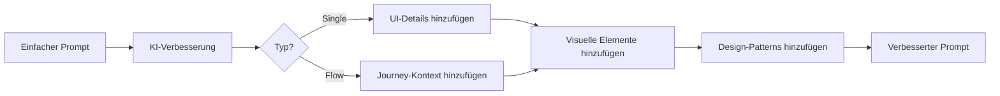

Transformiere einen einfachen Prompt in einen detaillierten, professionellen Prompt der bessere Generierungs-Ergebnisse produziert.

## Endpunkt

```
POST /api/enhance-prompt
```

## Request Body

<ParamField body="prompt" type="string" required>
  Der zu verbessernde einfache Prompt.
</ParamField>

<ParamField body="type" type="string" default="single">
  Art der Verbesserung:
  - `single` - Für einen einzelnen Screen verbessern
  - `flow` - Für einen Multi-Screen-Flow verbessern
</ParamField>

## Beispiel-Anfrage

```bash
curl -X POST http://localhost:3000/api/enhance-prompt \
  -H "Content-Type: application/json" \
  -d '{
    "prompt": "dashboard für analytics",
    "type": "single"
  }'
```

## Antwort

<ResponseField name="success" type="boolean">
  Ob die Verbesserung erfolgreich war.
</ResponseField>

<ResponseField name="enhancedPrompt" type="string">
  Der verbesserte, detaillierte Prompt.
</ResponseField>

### Erfolgs-Antwort

```json
{
  "success": true,
  "enhancedPrompt": "Ein modernes Analytics-Dashboard mit dunklem Theme und einer Top-Navigationsleiste mit Benutzer-Profil-Dropdown. Der Hauptinhaltsbereich zeigt vier Statistik-Karten mit Key-Metriken (Umsatz, Benutzer, Sessions, Conversion-Rate) mit Trend-Indikatoren. Darunter ein großes Flächendiagramm das Daten über Zeit mit Gradient-Füllung visualisiert. Die rechte Seitenleiste zeigt eine Liste aktueller Aktivitäten mit Zeitstempeln. Nutze eine Farbpalette aus tiefen Navy-Hintergründen mit leuchtenden Akzentfarben für Datenvisualisierung. Inkludiere subtile Schatten und abgerundete Ecken durchgehend für ein poliertes Aussehen."
}
```

## Verbesserungs-Vergleich

<Tabs>
  <Tab title="Einzelner Screen">
    **Vorher:**
    ```
    login seite
    ```
    
    **Nachher:**
    ```
    Eine moderne Login-Seite mit Split-Layout. Linke Seite zeigt einen Gradient-Hintergrund 
    mit App-Logo und motivierendem Slogan. Rechte Seite enthält das Login-Formular 
    mit Email- und Passwort-Eingaben, einem prominenten "Anmelden" Button und Links für 
    "Passwort vergessen" und "Account erstellen". Inkludiere Social Login Optionen (Google, Apple) 
    mit subtilen Trennlinien. Nutze weiche Schatten, abgerundete Eingabefelder und saubere 
    Sans-Serif-Typografie für professionelles Erscheinungsbild.
    ```
  </Tab>
  <Tab title="Flow">
    **Vorher:**
    ```
    onboarding für fitness app
    ```
    
    **Nachher:**
    ```
    Ein umfassender Onboarding-Flow für eine Fitness-Tracking-App mit 4-5 verbundenen Screens.
    Starte mit einem Willkommens-Screen der das App-Logo und einen überzeugenden Slogan über 
    Gesundheits-Transformation zeigt. Fortschritt durch Feature-Highlights mit Aktivitäts-Tracking, 
    Workout-Plänen und Ernährungs-Logging. Inkludiere einen Personalisierungs-Screen wo Benutzer 
    ihre Fitness-Ziele wählen (Abnehmen, Muskelaufbau, Erhaltung). Beende mit Account-Erstellung 
    die Email-Registrierung und Social-Authentifizierung anbietet. Halte konsistentes Branding 
    mit Fortschritts-Indikatoren und fließenden Übergängen zwischen Screens.
    ```
  </Tab>
</Tabs>

## Wie es funktioniert



Die KI fügt hinzu:

1. **UI-Elemente** - Spezifische Komponenten wie Buttons, Karten, Formulare
2. **Visuelles Design** - Farben, Schatten, Typografie, Abstände
3. **Layout-Details** - Struktur, Ausrichtung, Responsive-Überlegungen
4. **Interaktions-Hinweise** - Hover-States, Animationen, Übergänge
5. **Inhalts-Vorschläge** - Platzhalter-Text, Icons, Bilder

## Verwendung im Generierungs-Workflow

```javascript
async function generateWithEnhancement(userPrompt) {
  // Schritt 1: Prompt verbessern
  const enhanceResponse = await fetch('/api/enhance-prompt', {
    method: 'POST',
    headers: { 'Content-Type': 'application/json' },
    body: JSON.stringify({ prompt: userPrompt })
  });
  
  const { enhancedPrompt } = await enhanceResponse.json();
  
  // Schritt 2: Mit verbessertem Prompt generieren
  const generateResponse = await fetch('/api/generate-screen', {
    method: 'POST',
    headers: { 'Content-Type': 'application/json' },
    body: JSON.stringify({
      prompt: enhancedPrompt,
      sandboxId: activeSandbox.id
    })
  });
  
  return generateResponse.json();
}
```

## Flow-Verbesserung

Bei Flow-Verbesserung berücksichtigt die KI auch:

- **Screen-Anzahl** - Optimale Anzahl Screens für die Journey
- **Übergänge** - Wie Screens logisch verbunden sind
- **Konsistenz** - Visuelle Sprache über Screens halten
- **Benutzer-Journey** - Natürliche Progression durch den Flow

```javascript
const response = await fetch('/api/enhance-prompt', {
  method: 'POST',
  headers: { 'Content-Type': 'application/json' },
  body: JSON.stringify({
    prompt: 'checkout-prozess für online-shop',
    type: 'flow'
  })
});
```

## Fehler-Antwort

```json
{
  "success": false,
  "error": "GEMINI_API_KEY ist nicht konfiguriert"
}
```

## Konfiguration

Der Endpunkt verwendet Google's Gemini 2.0 Flash Modell für schnelle Verbesserung:

```env
GEMINI_API_KEY=dein-gemini-api-key
```

## Best Practices

1. **Starte einfach** - Lass die KI Details hinzufügen statt überzuspezifizieren
2. **Inkludiere Kontext** - Erwähne App-Typ oder Branche für relevante Vorschläge
3. **Nutze zur Exploration** - Generiere mehrere Verbesserungen um Ansätze zu vergleichen
4. **Prüfe vor Generierung** - Der verbesserte Prompt sollte deiner Vision entsprechen
