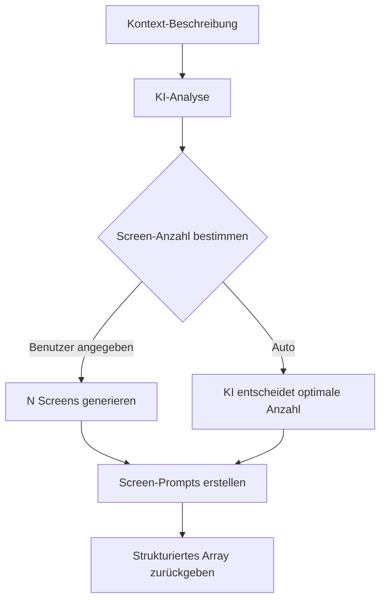

Generiere eine Serie zusammenhängender Screens die einen kompletten Benutzer-Flow bilden. Die KI analysiert deine Beschreibung und erstellt passend verbundene Screens.

## Endpunkt

```
POST /api/generate-flow
```

## Request Body

<ParamField body="context" type="string" required>
  Beschreibung des zu generierenden App-Flows. Sei spezifisch über die User Journey.
</ParamField>

<ParamField body="screenCount" type="number">
  Optionale exakte Anzahl zu generierender Screens. Wenn nicht angegeben, bestimmt die KI die optimale Anzahl (typisch 2-8 Screens).
</ParamField>

<ParamField body="images" type="array">
  Array von base64-kodierten Referenzbildern. Die KI matcht den visuellen Stil über alle generierten Screens.
</ParamField>

## Beispiel-Anfrage

```bash
curl -X POST http://localhost:3000/api/generate-flow \
  -H "Content-Type: application/json" \
  -d '{
    "context": "Onboarding-Flow für eine Fitness-Tracking-App mit Willkommen, Feature-Highlights, Zielsetzung und Account-Erstellung",
    "screenCount": 4
  }'
```

## Antwort

<ResponseField name="screens" type="array">
  Array von Screen-Objekten, jedes enthält:
  - `name`: Kurzer beschreibender Name für den Screen
  - `prompt`: Detaillierter Prompt zur Generierung dieses Screens
</ResponseField>

### Erfolgs-Antwort

```json
{
  "screens": [
    {
      "name": "Willkommen",
      "prompt": "FitTrack App Willkommens-Screen mit zentriertem Logo, motivierendem Slogan 'Deine Fitness-Reise beginnt hier', Hintergrund-Gradient in Markenfarben (Blau zu Lila), großer 'Los geht's' Button unten"
    },
    {
      "name": "Features",
      "prompt": "Feature-Highlights Screen zeigt 3 Hauptfeatures mit Icons: Aktivitäts-Tracking (Schritte, Kalorien), Workout-Pläne (personalisierte Routinen), Fortschritts-Charts (Wochen/Monats-Stats). 'Weiter' Button unten, Fortschritts-Punkte zeigen Schritt 2 von 4"
    },
    {
      "name": "Ziele",
      "prompt": "Zielsetzungs-Screen mit Optionen: Abnehmen, Muskeln aufbauen, Aktiv bleiben, Ausdauer verbessern. Jede Option als selektierbare Karte mit Icon. 'Weiter' Button, Mehrfach-Auswahl erlauben"
    },
    {
      "name": "Registrierung",
      "prompt": "Account-Erstellungs-Screen mit Email-Eingabe, Passwort-Eingabe, 'Account erstellen' Button. Social Login Optionen (Google, Apple). Link zu bestehendem Account Login. AGB-Checkbox"
    }
  ]
}
```

## Wie es funktioniert



## Verwendung mit Generate Screen

Der Flow-Endpunkt gibt Prompts zurück die an `/generate-screen` übergeben werden können:

```javascript
// 1. Flow-Struktur generieren
const flowResponse = await fetch('/api/generate-flow', {
  method: 'POST',
  headers: { 'Content-Type': 'application/json' },
  body: JSON.stringify({
    context: 'E-Commerce Checkout-Flow',
    screenCount: 3
  })
});

const { screens } = await flowResponse.json();

// 2. Jeden Screen generieren
for (const screen of screens) {
  await fetch('/api/generate-screen', {
    method: 'POST',
    headers: { 'Content-Type': 'application/json' },
    body: JSON.stringify({
      prompt: screen.prompt,
      sandboxId: activeSandboxId,
      pageSlug: screen.name.toLowerCase().replace(/\s+/g, '-')
    })
  });
}
```

## Referenzbilder für konsistenten Stil

Bei Bereitstellung von Referenzbildern hält die KI visuelle Konsistenz:

```javascript
const response = await fetch('/api/generate-flow', {
  method: 'POST',
  headers: { 'Content-Type': 'application/json' },
  body: JSON.stringify({
    context: 'Banking-App Onboarding-Flow',
    images: [
      'data:image/png;base64,iVBORw0KGgo...' // Marken-Referenz
    ]
  })
});
```

Die generierten Prompts referenzieren:
- Farbschemata aus der Referenz
- UI-Komponenten-Stile
- Typografie und Abstands-Muster
- Branding-Elemente

## Beispiel-Flows

<AccordionGroup>
  <Accordion title="Onboarding-Flow">
    ```json
    {
      "context": "Onboarding-Flow für FoodKey App - eine Rezept-Entdeckungs-App"
    }
    ```
    
    Gibt 3-4 Screens zurück: Willkommen, Feature-Highlights, Präferenzen, Los geht's
  </Accordion>
  
  <Accordion title="E-Commerce Checkout">
    ```json
    {
      "context": "Checkout-Flow für einen Online-Bekleidungsshop mit Warenkorb-Überprüfung, Versand und Zahlung"
    }
    ```
    
    Gibt 3-5 Screens zurück: Warenkorb, Versand, Zahlung, Bestätigung
  </Accordion>
  
  <Accordion title="Authentifizierungs-Flow">
    ```json
    {
      "context": "Authentifizierungs-Flow mit Login, Registrierung und Passwort-Wiederherstellung"
    }
    ```
    
    Gibt 3-4 Screens zurück: Login, Registrierung, Passwort vergessen, Reset-Bestätigung
  </Accordion>
  
  <Accordion title="Einstellungs-Flow">
    ```json
    {
      "context": "Benutzer-Einstellungen mit Profil, Benachrichtigungen, Datenschutz und Account-Verwaltung"
    }
    ```
    
    Gibt 4-5 Screens zurück: Profil, Benachrichtigungen, Datenschutz, Sicherheit, Account
  </Accordion>
</AccordionGroup>

## Best Practices

1. **Sei spezifisch** - Inkludiere App-Name, Zweck und Hauptfeatures in deinem Kontext
2. **Erwähne Übergänge** - Beschreibe wie Screens verbunden sind ("nach Login, Dashboard zeigen")
3. **Inkludiere UI-Hinweise** - Referenziere spezifische Komponenten wie "Karten", "Tabs", "Bottom-Navigation"
4. **Nutze Referenzbilder** - Für konsistentes Branding über alle Screens
5. **Setze Screen-Anzahl** - Wenn du eine spezifische Anzahl im Sinn hast

## Hinweise

- Die KI bestimmt automatisch die optimale Anzahl Screens wenn nicht angegeben
- Einfache Flows (wie Login) brauchen nur 1-2 Screens
- Komplexe Flows (wie Onboarding) können 5-8 Screens generieren
- Generierte Prompts halten konsistente Benennung und Styling über den Flow
