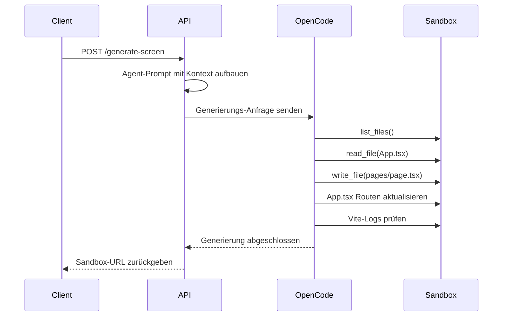

Generiere einen kompletten React-Screen mit KI. Der Endpunkt verwendet OpenCode KI um schöne, responsive UIs mit Tailwind CSS Styling zu erstellen.

## Endpunkt

```
POST /api/generate-screen
```

## Request Body

<ParamField body="prompt" type="string" required>
  Natürlichsprachliche Beschreibung des zu generierenden Screens.
</ParamField>

<ParamField body="sandboxId" type="string" required>
  Die ID einer aktiven Sandbox wo Code geschrieben wird.
</ParamField>

<ParamField body="width" type="number" default="375">
  Screen-Breite in Pixeln.
</ParamField>

<ParamField body="height" type="number" default="812">
  Screen-Höhe in Pixeln.
</ParamField>

<ParamField body="screenType" type="string" default="Mobile">
  Screen-Typ: `Mobile`, `Tablet`, oder `Desktop`.
</ParamField>

<ParamField body="pageSlug" type="string">
  URL-Slug für die generierte Seite. Automatisch generiert wenn nicht angegeben.
</ParamField>

<ParamField body="pageType" type="string" default="normal">
  Seitentyp:
  - `normal` - Standard Single-Screen
  - `landingpage` - Conversion-fokussierte Landing Page mit mehreren Sections
  - `funnel` - Multi-Step Funnel-Seite
</ParamField>

<ParamField body="sectionCount" type="number" default="10">
  Anzahl Sections für Landing Pages und Funnels.
</ParamField>

<ParamField body="images" type="array">
  Array von base64-kodierten Referenzbildern zur Design-Leitung.
</ParamField>

<ParamField body="model" type="string" default="anthropic/claude-sonnet-4.5">
  KI-Modell für Generierung. Optionen inkludieren:
  - `anthropic/claude-sonnet-4.5`
  - `google/gemini-2.0-flash`
  - `openai/gpt-4o`
</ParamField>

## Beispiel-Anfrage

```bash
curl -X POST http://localhost:3000/api/generate-screen \
  -H "Content-Type: application/json" \
  -d '{
    "prompt": "Ein modernes Dashboard mit Benutzer-Statistiken, Aktivitäts-Feed und Seitenleisten-Navigation",
    "sandboxId": "sandbox-abc123",
    "width": 1280,
    "height": 800,
    "screenType": "Desktop",
    "pageType": "normal",
    "model": "anthropic/claude-sonnet-4.5"
  }'
```

## Antwort

<ResponseField name="success" type="boolean">
  Ob die Generierung erfolgreich war.
</ResponseField>

<ResponseField name="sandboxUrl" type="string">
  Vollständige URL zur Ansicht der generierten Seite in der Sandbox.
</ResponseField>

<ResponseField name="pageSlug" type="string">
  URL-Slug der generierten Seite.
</ResponseField>

<ResponseField name="agentResponse" type="string">
  Ausgabe des KI-Agenten die beschreibt was erstellt wurde.
</ResponseField>

<ResponseField name="prompt" type="string">
  Der ursprüngliche verarbeitete Prompt.
</ResponseField>

<ResponseField name="useOpenCode" type="boolean">
  Zeigt an dass OpenCode KI für Generierung verwendet wurde.
</ResponseField>

### Erfolgs-Antwort

```json
{
  "success": true,
  "sandboxUrl": "https://sandbox-abc123.modal.run/dashboard",
  "pageSlug": "dashboard",
  "agentResponse": "Modernes Dashboard erstellt mit:\n- Benutzer-Stats-Karten oben\n- Aktivitäts-Feed in der Mitte\n- Seitenleisten-Navigation links\n\nModifizierte Dateien:\n- src/pages/dashboard.tsx (neu)\n- src/App.tsx (Routen aktualisiert)",
  "prompt": "Ein modernes Dashboard mit Benutzer-Statistiken...",
  "useOpenCode": true
}
```

### Fehler-Antwort

```json
{
  "error": "Sandbox für Generierung erforderlich. Bitte warten bis Sandbox initialisiert.",
  "details": "Keine Sandbox verfügbar"
}
```

## Wie es funktioniert



## Landing Page Generierung

Wenn `pageType` auf `landingpage` gesetzt ist, generiert die KI eine hochkonvertierende Landing Page mit strukturierten Sections:

```bash
curl -X POST http://localhost:3000/api/generate-screen \
  -H "Content-Type: application/json" \
  -d '{
    "prompt": "Eine SaaS Landing Page für ein Projektmanagement-Tool",
    "sandboxId": "sandbox-abc123",
    "screenType": "Desktop",
    "pageType": "landingpage",
    "sectionCount": 8
  }'
```

Die generierte Seite wird beinhalten:
- Hero-Section mit überzeugender Headline und CTA
- Problem/Lösungs-Section
- Features und Vorteile
- Social Proof und Testimonials
- Preis-Tabelle
- FAQ-Section
- Finaler Call-to-Action

## Referenzbilder verwenden

Übergib base64-kodierte Bilder zur Design-Leitung:

```javascript
const imageBase64 = await convertImageToBase64(file);

const response = await fetch('/api/generate-screen', {
  method: 'POST',
  headers: { 'Content-Type': 'application/json' },
  body: JSON.stringify({
    prompt: "Dieses Design mit modernem Styling nachbauen",
    sandboxId: "sandbox-abc123",
    images: [`data:image/png;base64,${imageBase64}`]
  })
});
```

## Hinweise

- Eine Sandbox muss vor Aufruf dieses Endpunkts initialisiert sein
- Der Endpunkt schreibt Dateien direkt via OpenCode in die Sandbox
- HMR (Hot Module Replacement) aktualisiert automatisch die Vorschau
- Keine Build-Befehle ausführen - Vite handhabt alles automatisch
