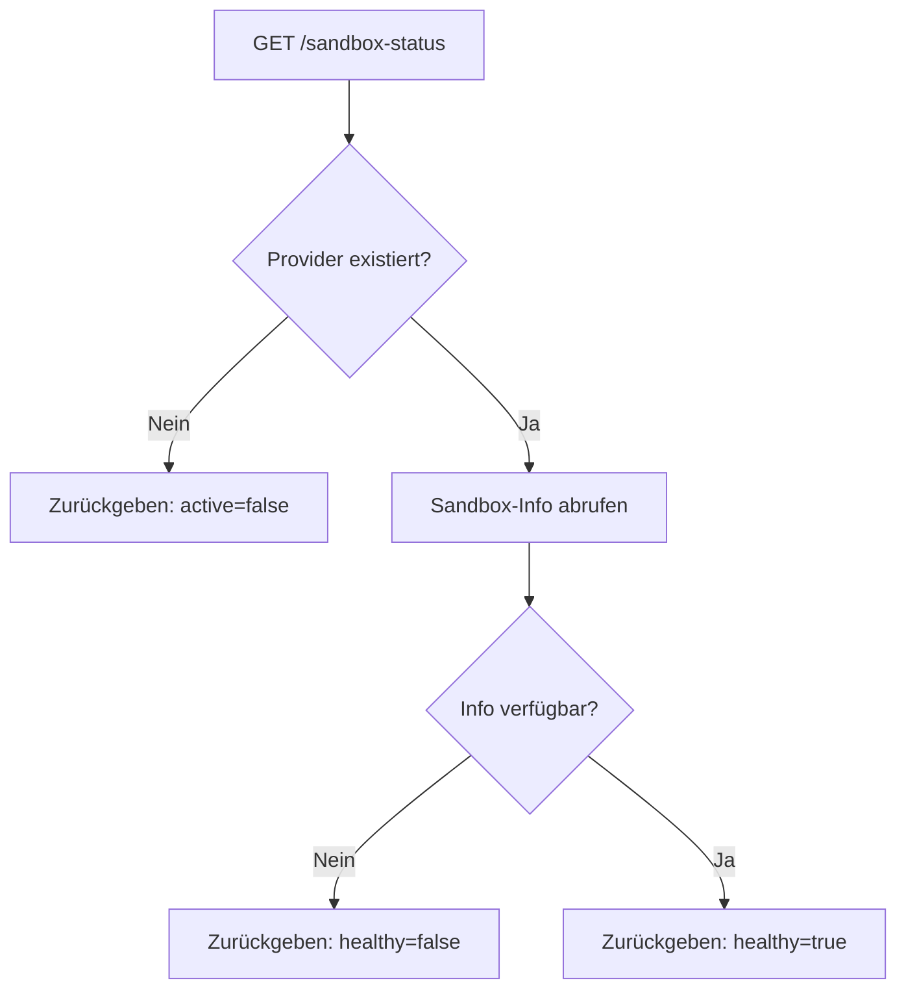

Aktuellen Status und Gesundheits-Informationen der aktiven Sandbox abrufen.

## Endpunkt

```
GET /api/sandbox-status
```

Keine Request-Parameter erforderlich. Gibt Informationen über die aktuell aktive Sandbox zurück.

## Antwort

<ResponseField name="success" type="boolean">
  Ob die Statusprüfung erfolgreich war.
</ResponseField>

<ResponseField name="active" type="boolean">
  Ob eine Sandbox existiert.
</ResponseField>

<ResponseField name="healthy" type="boolean">
  Ob die Sandbox antwortet und funktionsfähig ist.
</ResponseField>

<ResponseField name="sandboxData" type="object">
  Detaillierte Sandbox-Informationen:
  - `sandboxId`: Eindeutiger Identifikator
  - `url`: Vorschau-URL
  - `filesTracked`: Array bekannter Dateien
  - `lastHealthCheck`: Zeitstempel der letzten Prüfung
</ResponseField>

<ResponseField name="message" type="string">
  Lesbare Status-Beschreibung.
</ResponseField>

## Beispiel-Anfrage

```bash
curl http://app.seemodo.ai/api/sandbox-status
```

### Aktiv und gesund

```json
{
  "success": true,
  "active": true,
  "healthy": true,
  "sandboxData": {
    "sandboxId": "modal-sandbox-1234",
    "url": "https://seemodo--sandbox-1234.modal.run",
    "filesTracked": [
      "src/App.tsx",
      "src/main.jsx",
      "src/index.css",
      "src/pages/dashboard.tsx"
    ],
    "lastHealthCheck": "2024-01-15T10:30:00.000Z"
  },
  "message": "Sandbox ist aktiv und gesund"
}
```

### Sandbox existiert aber ist nicht gesund

```json
{
  "success": true,
  "active": true,
  "healthy": false,
  "sandboxData": null,
  "message": "Sandbox existiert aber antwortet nicht"
}
```

### Keine aktive Sandbox

```json
{
  "success": true,
  "active": false,
  "healthy": false,
  "sandboxData": null,
  "message": "Keine aktive Sandbox"
}
```

## Verwendung in Anwendungen

```javascript
async function checkSandboxHealth() {
  const response = await fetch('/api/sandbox-status');
  const status = await response.json();
  
  if (!status.active) {
    // Neue Sandbox erstellen
    await createSandbox();
    return;
  }
  
  if (!status.healthy) {
    // Sandbox existiert aber antwortet nicht - neu erstellen
    await killSandbox(status.sandboxData?.sandboxId);
    await createSandbox();
    return;
  }
  
  // Sandbox ist bereit zur Nutzung
  return status.sandboxData;
}
```

## Gesundheitsprüfungs-Flow



## Polling auf Bereitschaft

Beim Warten bis Sandbox bereit ist:

```javascript
async function waitForSandbox(maxAttempts = 30) {
  for (let i = 0; i < maxAttempts; i++) {
    const response = await fetch('/api/sandbox-status');
    const status = await response.json();
    
    if (status.active && status.healthy) {
      return status.sandboxData;
    }
    
    // 2 Sekunden zwischen Prüfungen warten
    await new Promise(resolve => setTimeout(resolve, 2000));
  }
  
  throw new Error('Sandbox wurde nicht bereit');
}
```

## Verwandte Endpunkte

| Endpunkt | Beschreibung |
|----------|--------------|
| `POST /api/create-ai-sandbox-v2` | Neue Sandbox erstellen |
| `GET /api/get-sandbox-files` | Dateien in Sandbox auflisten |
| `POST /api/kill-sandbox` | Sandbox beenden |
| `POST /api/restart-vite` | Dev-Server neustarten |
