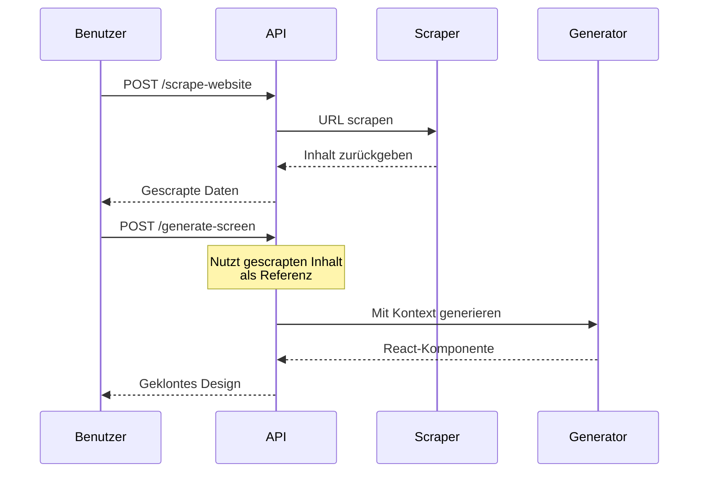

Inhalt, Struktur und Styling einer Website scrapen zur Verwendung als Referenz für KI-Generierung.

## Endpunkt

```
POST /api/scrape-website
```

## Request Body

<ParamField body="url" type="string" required>
  Die URL der zu scrapenden Website.
</ParamField>

<ParamField body="formats" type="array" default="['markdown', 'html']">
  Ausgabeformate zum Inkludieren:
  - `markdown` - Sauberer Markdown-Inhalt
  - `html` - Rohe HTML-Struktur
  - `screenshot` - Seiten-Screenshot
</ParamField>

<ParamField body="options" type="object">
  Zusätzliche Scraping-Optionen:
  - `onlyMainContent`: Boolean - Nur Hauptinhalt extrahieren (Standard: true)
  - `waitFor`: Number - Wartezeit für dynamischen Inhalt in ms (Standard: 2000)
  - `timeout`: Number - Request-Timeout in ms (Standard: 30000)
</ParamField>

## Beispiel-Anfrage

```bash
curl -X POST http://app.seemodo.ai/api/scrape-website \
  -H "Content-Type: application/json" \
  -d '{
    "url": "https://example.com/landing-page",
    "formats": ["markdown", "html"],
    "options": {
      "onlyMainContent": true,
      "waitFor": 3000
    }
  }'
```

## Antwort

<ResponseField name="success" type="boolean">
  Ob das Scraping erfolgreich war.
</ResponseField>

<ResponseField name="data" type="object">
  Gescrapte Inhalte:
  - `title`: Seitentitel
  - `description`: Meta-Beschreibung
  - `content`: Kombinierter Inhalt
  - `markdown`: Markdown-Version
  - `html`: HTML-Version
  - `metadata`: Seiten-Metadaten
  - `screenshot`: Base64-Screenshot (wenn angefordert)
  - `links`: Extrahierte Links
</ResponseField>

### Erfolgs-Antwort

```json
{
  "success": true,
  "data": {
    "title": "Acme Inc - Bessere Produkte bauen",
    "description": "Acme hilft Teams Produkte schneller zu bauen und auszuliefern.",
    "content": "# Acme Inc\n\nBessere Produkte bauen...",
    "markdown": "# Acme Inc\n\n## Bessere Produkte bauen\n\nAcme hilft Teams Produkte schneller mit KI-gestützten Tools zu bauen und auszuliefern.\n\n### Features\n\n- **Geschwindigkeit**: 10x schneller ausliefern\n- **Qualität**: KI-gestützte Code-Review\n- **Zusammenarbeit**: Echtzeit-Bearbeitung\n\n...",
    "html": "<header><nav>...</nav></header><main><h1>Acme Inc</h1>...</main>",
    "metadata": {
      "title": "Acme Inc - Bessere Produkte bauen",
      "description": "Acme hilft Teams Produkte schneller zu bauen und auszuliefern.",
      "sourceURL": "https://example.com/landing-page",
      "statusCode": 200,
      "ogImage": "https://example.com/og-image.png"
    },
    "screenshot": null,
    "links": [
      "https://example.com/features",
      "https://example.com/pricing",
      "https://example.com/about"
    ]
  }
}
```

## Website-Klon-Workflow



## Gescrapten Inhalt für Generierung nutzen

```javascript
// Schritt 1: Ziel-Website scrapen
const scrapeResponse = await fetch('/api/scrape-website', {
  method: 'POST',
  headers: { 'Content-Type': 'application/json' },
  body: JSON.stringify({
    url: 'https://example.com'
  })
});

const { data } = await scrapeResponse.json();

// Schritt 2: Klon generieren
const generateResponse = await fetch('/api/generate-screen', {
  method: 'POST',
  headers: { 'Content-Type': 'application/json' },
  body: JSON.stringify({
    prompt: `Klone dieses Website-Design:\n\n${data.markdown}`,
    sandboxId: activeSandbox.id,
    screenType: 'Desktop'
  })
});
```

## Erweitertes Scraping

Für detailliertere Extraktion nutze den erweiterten Endpunkt:

```
POST /api/scrape-url-enhanced
```

Dies bietet:
- Bessere Handhabung von SPAs
- CSS-Extraktion
- Asset-Download
- Struktur-Analyse

## Screenshot-Aufnahme

Für visuelle Referenz:

```
POST /api/scrape-screenshot
```

```json
{
  "url": "https://example.com",
  "fullPage": true,
  "width": 1280,
  "height": 800
}
```

Gibt einen base64-kodierten Screenshot zurück der als Referenzbild genutzt werden kann.

## Fehlerbehandlung

### Scraping fehlgeschlagen

```json
{
  "success": false,
  "error": "Website-Scraping fehlgeschlagen",
  "data": {
    "title": "Fehler",
    "markdown": "# Fehler\n\nVerbindungs-Timeout beim Abrufen der Seite."
  }
}
```

## Einschränkungen

- Manche Websites blockieren automatisches Scraping
- JavaScript-lastige SPAs rendern möglicherweise nicht vollständig
- Rate-Limits können gelten

## Best Practices

1. **Nutze `onlyMainContent`** - Schließt Header/Footer für saubereren Inhalt aus
2. **Erhöhe `waitFor`** - Für dynamischen Inhalt länger warten
3. **Kombiniere mit Screenshots** - Visuelle Referenz verbessert Generierung
4. **Prüfe das Markdown** - Verifiziere dass wichtiger Inhalt erfasst wurde
