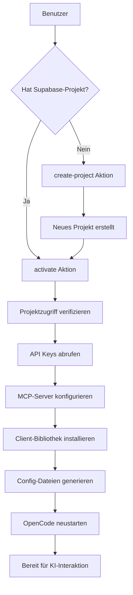

Verbinde deine Sandbox mit Supabase für Datenbank-, Authentifizierungs- und Storage-Funktionen. Die KI kann dann direkt mit deinem Backend interagieren.

## Endpunkt

```
POST /api/seemodo-cloud
```

## Authentifizierung

Alle Anfragen erfordern einen Supabase API-Token im Header:

```bash
-H "X-Supabase-Token: dein-supabase-access-token"
```

Access Token erhältst du unter: Supabase Dashboard → Account → Access Tokens

## Aktionen

Der Endpunkt unterstützt drei Aktionen:

| Aktion | Beschreibung |
|--------|--------------|
| `activate` | Supabase-Projekt mit Sandbox verbinden |
| `create-project` | Neues Supabase-Projekt erstellen |
| `status` | Verbindungsstatus prüfen |

---

## Cloud aktivieren

Bestehendes Supabase-Projekt mit deiner Sandbox verbinden.

### Request Body

<ParamField body="action" type="string" required>
  Muss `"activate"` sein
</ParamField>

<ParamField body="projectRef" type="string" required>
  Deine Supabase Projekt-Referenz-ID (z.B. `abcdefghijklmnop`).
</ParamField>

<ParamField body="sandboxId" type="string" required>
  Die ID der aktiven Sandbox.
</ParamField>

<ParamField body="sandboxApiUrl" type="string" required>
  Die API-URL des Sandbox-Backends.
</ParamField>

### Beispiel-Anfrage

```bash
curl -X POST http://localhost:3000/api/seemodo-cloud \
  -H "Content-Type: application/json" \
  -H "X-Supabase-Token: sbp_dein_token_hier" \
  -d '{
    "action": "activate",
    "projectRef": "abcdefghijklmnop",
    "sandboxId": "modal-sandbox-1234",
    "sandboxApiUrl": "https://seemodo--sandbox-backend.modal.run"
  }'
```

### Erfolgs-Antwort

```json
{
  "success": true,
  "project": {
    "ref": "abcdefghijklmnop",
    "name": "Mein Projekt",
    "region": "eu-central-1",
    "endpoint": "https://abcdefghijklmnop.supabase.co"
  },
  "apiKeys": {
    "anon": "eyJhbGciOiJIUzI1NiIsInR5cCI6IkpXVCJ9...",
    "service_role": "eyJhbGciOiJIUzI1NiIsInR5cCI6IkpXVCJ9..."
  },
  "mcpServerName": "supabase_abcdefghijklmnop",
  "mcpAuthUrl": null,
  "mcpAuthNeeded": false
}
```

### Was Aktivierung macht

<Steps>
  <Step title="Projekt verifizieren">
    Bestätigt dass du Zugriff auf das Supabase-Projekt hast.
  </Step>
  <Step title="API Keys abrufen">
    Ruft anon und service_role Keys ab.
  </Step>
  <Step title="MCP konfigurieren">
    Richtet den Supabase MCP-Server in OpenCode ein.
  </Step>
  <Step title="Client installieren">
    Fügt `@supabase/supabase-js` zur Sandbox hinzu.
  </Step>
  <Step title="Config erstellen">
    Generiert `src/lib/supabase.ts` mit Verbindungsdetails.
  </Step>
  <Step title="Regeln hinzufügen">
    Kopiert Supabase Best-Practice-Regeln für die KI.
  </Step>
</Steps>

---

## Projekt erstellen

Neues Supabase-Projekt erstellen.

### Request Body

<ParamField body="action" type="string" required>
  Muss `"create-project"` sein
</ParamField>

<ParamField body="name" type="string" required>
  Name für das neue Projekt.
</ParamField>

<ParamField body="organizationId" type="string" required>
  Deine Supabase Organisations-ID.
</ParamField>

### Beispiel-Anfrage

```bash
curl -X POST http://localhost:3000/api/seemodo-cloud \
  -H "Content-Type: application/json" \
  -H "X-Supabase-Token: sbp_dein_token_hier" \
  -d '{
    "action": "create-project",
    "name": "Meine Neue App",
    "organizationId": "org-abc123"
  }'
```

### Erfolgs-Antwort

```json
{
  "success": true,
  "projectRef": "newprojectref123",
  "project": {
    "ref": "newprojectref123",
    "name": "Meine Neue App",
    "region": "eu-central-1",
    "endpoint": "https://newprojectref123.supabase.co"
  }
}
```

---

## Status prüfen

Prüfen ob ein Projekt verbunden und erreichbar ist.

### Request Body (POST)

```json
{
  "action": "status",
  "projectRef": "abcdefghijklmnop"
}
```

### Query-Parameter (GET)

```
GET /api/seemodo-cloud?projectRef=abcdefghijklmnop
```

### Erfolgs-Antwort

```json
{
  "activated": true,
  "project": {
    "ref": "abcdefghijklmnop",
    "name": "Mein Projekt",
    "status": "ACTIVE_HEALTHY",
    "region": "eu-central-1"
  }
}
```

---

## In Sandbox erstellte Dateien

Nach Aktivierung werden diese Dateien erstellt:

### `/src/lib/supabase.ts`

```typescript
import { createClient } from '@supabase/supabase-js';

const supabaseUrl = 'https://abcdefghijklmnop.supabase.co';
const supabaseAnonKey = 'eyJhbGciOiJIUzI1NiIs...';

export const supabase = createClient(supabaseUrl, supabaseAnonKey);
```

### `/AGENTS.md`

Enthält Anweisungen für die KI über:
- Verwendung von pnpm (nicht npm)
- Supabase-Konfigurationsdetails
- MCP-Server-Verwendungsbeispiele
- Best Practices für Datenbank, Auth, Storage

### `/.opencode/opencode.json`

Konfiguriert den Supabase MCP-Server für direkten Datenbankzugriff.

---

## Mit KI verwenden

Nach Aktivierung kannst du die KI bitten:

```
Erstelle eine users-Tabelle mit id, email, name und created_at Spalten.
Füge RLS-Policies hinzu damit Benutzer nur ihre eigenen Daten lesen können.
```

```
Richte Authentifizierung mit Email/Passwort und Google OAuth ein.
```

```
Erstelle einen Storage-Bucket für Benutzer-Avatare mit Größenbeschränkungen.
```

Die KI nutzt den MCP-Server um diese direkt auf Supabase auszuführen.

---

## Fehler-Antworten

### Ungültiger Token

```json
{
  "message": "API-Token erforderlich"
}
```

### Projekt nicht gefunden

```json
{
  "message": "Projekt nicht gefunden oder Zugriff verweigert"
}
```

### Setup fehlgeschlagen

```json
{
  "message": "Supabase-Setup in Sandbox fehlgeschlagen: Verbindung abgelehnt"
}
```

---

## Flow-Diagramm



## Verwandt

- [Seemodo Cloud Anleitung](/de/seemodo/cloud) - Vollständige Cloud-Integrations-Dokumentation
- [Architektur](/de/seemodo/architecture) - System-Architektur-Übersicht
