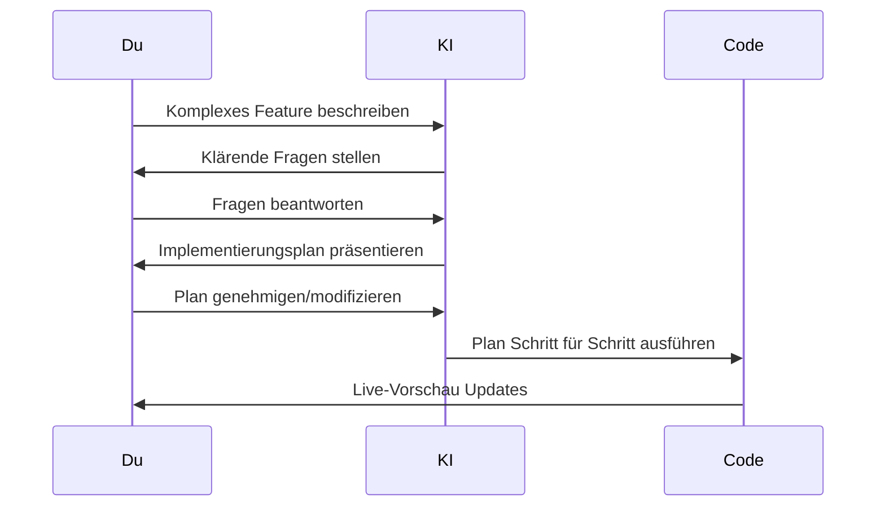

Der KI-Coder ist Seemodos intelligenter Coding-Assistent. Er kann Dateien lesen, Code schreiben, Befehle ausführen und Fehler automatisch beheben - alles durch natürlichsprachliche Konversation.

## Übersicht

Das KI-Coder Panel erscheint im Sandbox-Panel nach der Generierung eines Screens oder Erstellung einer Sandbox. Es bietet zwei Interaktionsmodi:

<Tabs>
  <Tab title="Agent-Modus">
    **Direkte Coding-Unterstützung** - Die KI handelt sofort auf deine Anfragen.

    Beste Verwendung für:
    - Schnelle Änderungen und Fixes
    - Einzelne Features hinzufügen
    - Probleme debuggen
    - Datei-Operationen

    Die KI kann:
    - Code-Dateien lesen und analysieren
    - Neue Dateien schreiben oder bestehende bearbeiten
    - Terminal-Befehle ausführen
    - npm-Pakete installieren
    - Änderungen automatisch zu Git committen
  </Tab>
  <Tab title="Plan-Modus">
    **Interaktives Brainstorming** - Die KI führt dich durch einen Planungsprozess vor dem Coden.

    Beste Verwendung für:
    - Komplexe Multi-Step Features
    - Architektur-Entscheidungen
    - Neues Projekt-Scaffolding
    - Features mit vielen Optionen

    Die KI wird:
    - Klärende Fragen stellen
    - Optionen zur Auswahl präsentieren
    - Einen strukturierten Implementierungsplan erstellen
    - Den Plan nach Genehmigung ausführen
  </Tab>
</Tabs>

## Agent-Modus nutzen

### Grundlegender Workflow

1. **Sandbox-Panel öffnen** durch Klick auf den Terminal-Button nach Generierung eines Screens
2. **Sicherstellen dass du im Agent-Modus bist** (Standard)
3. **Anfrage eintippen** in natürlicher Sprache
4. **KI bei der Arbeit zuschauen** - Dateien werden gelesen/geschrieben, Befehle ausgeführt
5. **Änderungen in der Live-Sandbox vorab anzeigen**

### Beispiel-Anfragen

<AccordionGroup>
  <Accordion title="Features hinzufügen">
    ```
    Füge einen Dark-Mode-Toggle zum Header hinzu der in localStorage persistiert
    ```

    ```
    Erstelle ein Lade-Skeleton für die Benutzerlisten-Komponente
    ```

    ```
    Füge Formular-Validierung zum Signup-Formular mit Fehlermeldungen hinzu
    ```
  </Accordion>

  <Accordion title="Bestehenden Code bearbeiten">
    ```
    Ändere die primäre Button-Farbe von Blau zu Lila
    ```

    ```
    Mache die Seitenleiste auf mobilen Bildschirmen einklappbar
    ```

    ```
    Füge sanfte Übergänge zu allen Button-Hover-States hinzu
    ```
  </Accordion>

  <Accordion title="Debugging">
    ```
    Behebe den TypeScript-Fehler in der Header-Komponente
    ```

    ```
    Die Benutzerliste lädt nicht - kannst du prüfen was falsch ist?
    ```

    ```
    Es gibt ein Layout-Problem auf Mobile, bitte untersuchen
    ```
  </Accordion>

  <Accordion title="Paket-Installation">
    ```
    Installiere framer-motion und füge Seitenübergangs-Animationen hinzu
    ```

    ```
    Füge react-hook-form für bessere Formular-Handhabung hinzu
    ```

    ```
    Installiere und konfiguriere zustand für State-Management
    ```
  </Accordion>
</AccordionGroup>

### Tool-Indikatoren

Die KI zeigt in Echtzeit welche Tools sie verwendet:

| Icon | Tool | Beschreibung |
|------|------|--------------|
| 👁️ | Read | Datei lesen |
| ✏️ | Edit | Datei modifizieren |
| 📝 | Write | Neue Datei erstellen |
| 🖥️ | Bash | Terminal-Befehl ausführen |
| 🔍 | Search | Codebase durchsuchen |
| ✅ | Done | Tool erfolgreich abgeschlossen |

Klicke auf jede Tool-Aktion um Details zu erweitern und anzuzeigen.

## Plan-Modus nutzen

Plan-Modus ist für komplexe Anfragen konzipiert die von Diskussion vor der Implementierung profitieren.

### Wie es funktioniert



### Frage-Typen

Die KI kann verschiedene Arten von Fragen stellen:

<CardGroup cols={2}>
  <Card title="Eine auswählen" icon="circle-check">
    Wähle eine einzelne Option aus mehreren Möglichkeiten.
  </Card>
  <Card title="Mehrere auswählen" icon="check-double">
    Wähle mehrere zutreffende Optionen.
  </Card>
  <Card title="Texteingabe" icon="keyboard">
    Gib eine Freitext-Antwort.
  </Card>
  <Card title="Bestätigen" icon="thumbs-up">
    Ja/Nein Bestätigung für eine Entscheidung.
  </Card>
  <Card title="Bewerten" icon="star">
    Etwas auf einer Skala bewerten.
  </Card>
  <Card title="Slider" icon="sliders">
    Einen Wert entlang eines Bereichs setzen.
  </Card>
</CardGroup>

### Beispiel-Session

```
Du: Baue ein komplettes Benutzer-Authentifizierungssystem

KI: Ich helfe dir bei der Authentifizierung. Zunächst ein paar Fragen:

Q1: Welche Authentifizierungsmethoden brauchst du?
   ☑️ Email/Passwort
   ☑️ Google OAuth
   ☐ GitHub OAuth
   ☐ Magic Link
   
Q2: Brauchst du rollenbasierte Zugriffskontrolle?
   ○ Ja, mit Admin- und Benutzer-Rollen
   ● Nein, alle Benutzer haben gleiche Berechtigungen
   
Q3: Wohin sollen Benutzer nach Login weitergeleitet werden?
   [Dashboard]

KI: Super! Hier ist der Plan:
1. Auth-Context mit Login/Logout-Funktionen erstellen
2. Login- und Signup-Formulare bauen
3. Google OAuth Integration hinzufügen
4. Protected-Route-Wrapper erstellen
5. Benutzermenü im Header hinzufügen

Bereit zum Ausführen? [Plan ausführen]
```

## Referenzbilder

Lade Bilder hoch um visuellen Kontext für die KI bereitzustellen:

1. Klicke das **Bild-Icon** in der Chat-Eingabe
2. Wähle ein oder mehrere Bilder aus
3. Füge deinen Prompt hinzu der beschreibt was du möchtest
4. Die KI wird die Bilder als Referenz nutzen

<Tip>
  Referenzbilder sind besonders nützlich für:
  - Einen bestimmten Design-Stil zu matchen
  - UI aus Screenshots nachzubauen
  - Mockups aus Figma zu implementieren
</Tip>

## Ausgewählter Komponenten-Kontext

Nutze **React Grab** um Komponenten direkt in der Vorschau auszuwählen:

1. Aktiviere React Grab Modus in der Vorschau-Toolbar
2. Klicke auf eine beliebige Komponente in der Vorschau
3. Der Code-Kontext der Komponente wird automatisch an deine nächste Nachricht angehängt
4. Bitte die KI diese spezifische Komponente zu modifizieren

```
[Ausgewählte Komponente: Button in src/components/ui/Button.tsx]

Gib diesem Button einen Gradient-Hintergrund und einen subtilen Schatten
```

## Auto-Features

### Auto Commit

Nach Dateiänderungen durch die KI wird automatisch ein Git-Commit mit beschreibender Nachricht erstellt. Das gibt dir eine vollständige Historie aller KI-unterstützten Änderungen.

Commit-Historie anzeigen:
```bash
git log --oneline
```

### Auto Paket-Erkennung

Wenn die KI Code schreibt der neue Pakete importiert, werden diese automatisch erkannt und installiert. Du siehst eine Benachrichtigung wenn Pakete installiert werden.

### Fehler-Wiederherstellung

Wenn ein Vite Build-Fehler auftritt, wird die KI:
1. Den Fehler automatisch erkennen
2. Die relevante Datei lesen
3. Das Problem beheben
4. Verifizieren dass der Fix funktioniert hat

## Modell-Auswahl

Wenn der Modell-Selektor aktiviert ist (`?model=true` in URL), kannst du wählen welches KI-Modell deine Anfragen bearbeitet:

| Modell | Stärken |
|--------|---------|
| **Gemini 3 Pro** | Ausgewogen, gute Standardwahl |
| **Claude Sonnet 4** | Exzellent für komplexes Reasoning |
| **GPT-5** | Starke allgemeine Performance |
| **Kimi K2** | Schnelle Antworten via Groq |

<Note>
  Der Modell-Selektor ist nur sichtbar wenn `?model=true` zur URL hinzugefügt wird.
</Note>

## Tipps für beste Ergebnisse

<Steps>
  <Step title="Spezifisch sein">
    Statt "mach es schöner", sage "füge abgerundete Ecken, Schatten und einen Gradient-Hintergrund hinzu".
  </Step>
  <Step title="Kontext liefern">
    Erwähne Dateinamen wenn du sie kennst: "in der Header-Komponente, füge hinzu..."
  </Step>
  <Step title="Plan-Modus für Komplexität">
    Für Features die mehrere Dateien berühren, stellt Plan-Modus gründliche Implementierung sicher.
  </Step>
  <Step title="In kleinen Schritten iterieren">
    Mehrere kleine Anfragen funktionieren oft besser als eine große.
  </Step>
  <Step title="Referenzbilder hochladen">
    Visuelle Beispiele helfen der KI genau zu verstehen was du möchtest.
  </Step>
</Steps>

## Supabase-Integration

Wenn [Seemodo Cloud](/de/seemodo/cloud) verbunden ist, hat die KI direkten Zugriff auf dein Supabase-Projekt:

- Datenbank-Tabellen erstellen und modifizieren
- Authentifizierung einrichten
- Storage-Buckets konfigurieren
- Edge Functions schreiben
- RLS-Policies erstellen

Alle Supabase-Operationen nutzen das MCP (Model Context Protocol) für nahtlose Integration.
