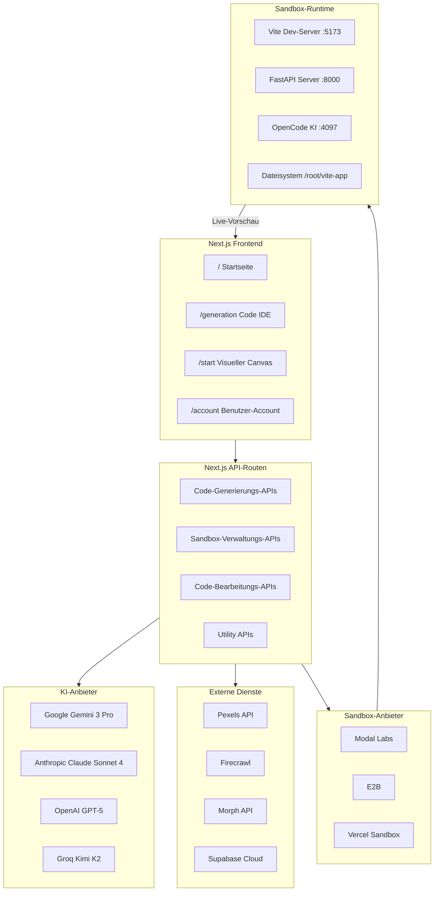
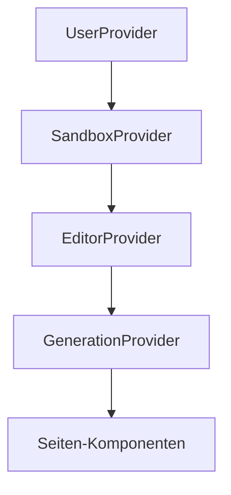
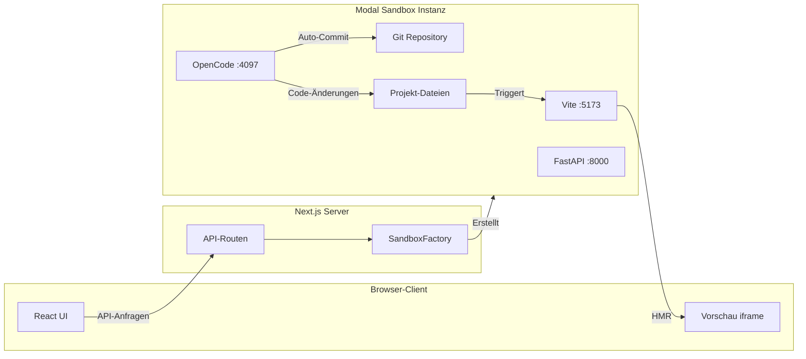
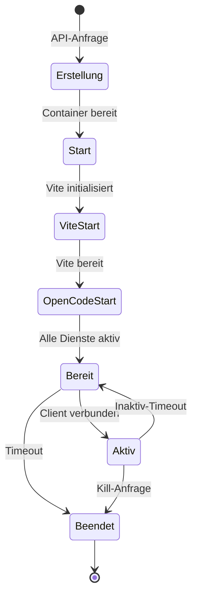
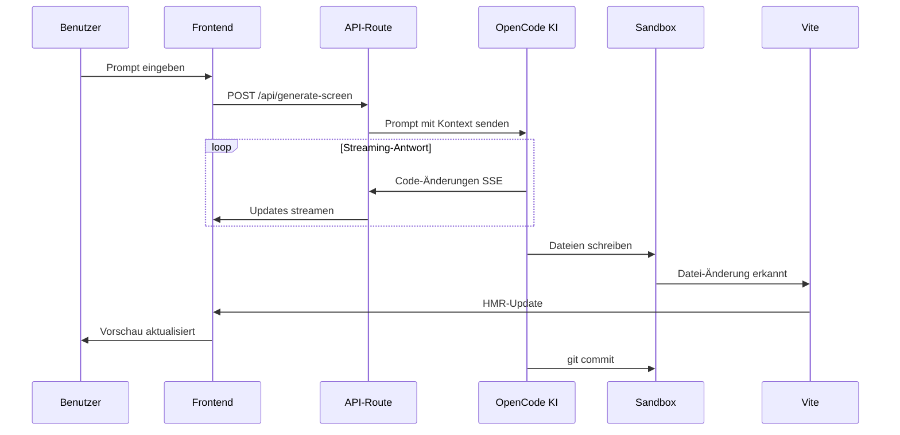
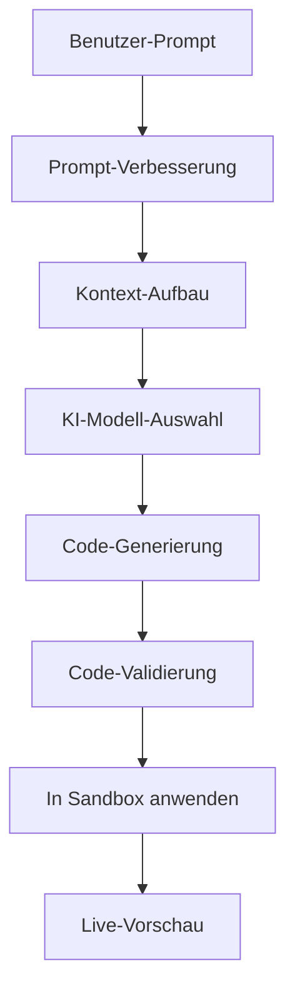
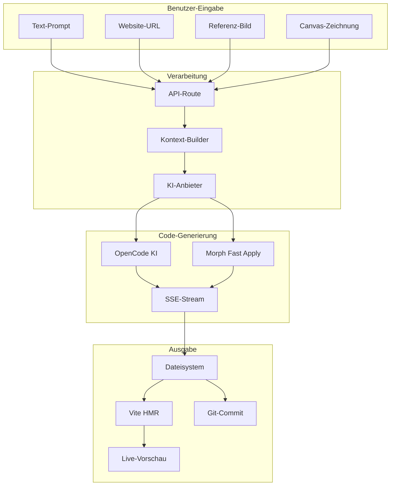

Dieses Dokument bietet eine umfassende technische Übersicht über Seemodos Architektur für Entwickler, die das System verstehen oder erweitern möchten.

## System-Übersicht



## Frontend-Architektur

### Seiten

| Route | Komponente | Zweck |
|-------|------------|-------|
| `/` | `app/page.tsx` | Minimale Startseite mit Prompt-Eingabe |
| `/start` | `app/start/page.tsx` | Visueller Canvas-Designer |
| `/generation` | `app/generation/page.tsx` | Vollständige Code-IDE |
| `/account` | `app/account/page.tsx` | Benutzer-Account-Verwaltung |

### Context-Provider

Die App verwendet verschachtelte React Context für State-Management:



| Context | Zweck | Wichtiger State |
|---------|-------|-----------------|
| `UserProvider` | Benutzer-Authentifizierung und Profil | Benutzer-Daten, Auth-State |
| `SandboxProvider` | Sandbox-Lebenszyklus-Verwaltung | Sandbox-ID, URLs, Seiten |
| `EditorProvider` | Code-Bearbeitungs-State | Aktuelle Datei, Editor-Inhalt |
| `GenerationProvider` | Generierungs-State | Generierte Screens, Prompts |

### Wichtige Komponenten

```
app/start/
├── page.tsx              # Hauptseite mit Providern
├── components/
│   ├── TopHeader.tsx     # Navigations-Header
│   ├── LeftSidebar.tsx   # Prompt und Einstellungen
│   ├── TldrawCanvas.tsx  # tldraw-Integration
│   ├── SandboxPanel.tsx  # Vorschau und Terminal
│   ├── OpenCodePanel.tsx # KI-Chat-Interface
│   ├── ModelSelector.tsx # KI-Modell-Auswahl
│   └── brainstorm/       # Plan-Modus Komponenten
└── lib/
    ├── sandbox-context.tsx
    ├── generation-context.tsx
    └── editor-context.tsx
```

## Sandbox-Architektur

### Provider Factory Pattern

```typescript
// lib/sandbox/factory.ts
export function createSandboxProvider(): SandboxProvider {
  const provider = process.env.SANDBOX_PROVIDER || 'modal';
  
  switch (provider) {
    case 'modal':
      return new ModalProvider();
    case 'e2b':
      return new E2BProvider();
    case 'vercel':
      return new VercelProvider();
    default:
      throw new Error(`Unbekannter Anbieter: ${provider}`);
  }
}
```

### Modal Sandbox Instanz



### Sandbox-Lebenszyklus



## KI-Generierungs-Ablauf

### Code-Generierungs-Pipeline



### Prompt-Verarbeitung



## OpenCode-Integration

### Client-Architektur

```typescript
// Mit @opencode-ai/sdk
const client = createOpencodeClient({ baseUrl: opencodeUrl });

// Session-Verwaltung
const session = await client.session.create({
  body: { title: 'Seemodo Session' }
});

// Prompt senden
await client.session.prompt({
  path: { id: session.id },
  body: { 
    parts: [{ type: 'text', text: message }],
    model: { providerID: 'vercel', modelID: 'claude-sonnet-4' }
  }
});

// Event-Stream
const eventSource = new EventSource(`${opencodeUrl}/event`);
eventSource.onmessage = (event) => {
  const data = JSON.parse(event.data);
  // Tool-Aufrufe, Text, Fehler verarbeiten
};
```

### Tool-Typen

| Tool | Beschreibung | Events |
|------|--------------|--------|
| Read | Datei-Inhalte lesen | `tool.read.start`, `tool.read.result` |
| Write | Datei erstellen/überschreiben | `tool.write.result` |
| Edit | Datei-Abschnitte modifizieren | `tool.str_replace.result` |
| Bash | Befehle ausführen | `tool.bash.start`, `tool.bash.result` |
| Search | Codebase durchsuchen | `tool.search.result` |

## Datenfluss

### Generierungs-Anfrage



## Tech Stack

### Frontend

| Technologie | Zweck |
|-------------|-------|
| Next.js 16 | React-Framework mit App Router |
| TypeScript | Typ-Sicherheit |
| Tailwind CSS | Styling |
| Radix UI | Zugängliche Primitiven |
| Shadcn/ui | Komponenten-Bibliothek |
| tldraw | Canvas/Wireframe-Editor |
| Framer Motion | Animationen |
| Jotai | Atomares State-Management |
| xterm.js | Terminal-Emulator |

### Backend

| Technologie | Zweck |
|-------------|-------|
| Next.js API-Routen | Backend-Endpunkte |
| Vercel AI SDK | KI-Modell-Integration |
| Modal Labs | Sandbox-Infrastruktur |
| Python/FastAPI | Modal Sandbox Server |
| OpenCode SDK | KI-Coding-Assistent |

### Externe Dienste

| Dienst | Zweck |
|--------|-------|
| Google Gemini | Standard-KI-Modell |
| Anthropic Claude | Alternatives KI-Modell |
| OpenAI GPT | Alternatives KI-Modell |
| Groq | Schnelle Inferenz (Kimi K2) |
| Firecrawl | Website-Scraping |
| Pexels | Stock-Bilder |
| Morph | Schnelle Code-Anwendung |
| Supabase | Backend-as-a-Service |

## Projekt-Struktur

```
seemodo-app/
├── app/                        # Next.js App Router
│   ├── page.tsx               # Startseite
│   ├── layout.tsx             # Root-Layout
│   ├── start/                 # Visueller Canvas
│   │   ├── page.tsx
│   │   ├── components/
│   │   └── lib/
│   ├── generation/            # Code-IDE
│   ├── account/               # Benutzer-Account
│   └── api/                   # API-Routen
├── components/                 # Gemeinsame Komponenten
│   ├── ui/                    # Basis-UI-Komponenten
│   └── shared/                # Gemeinsame Features
├── lib/                       # Utilities und Logik
│   ├── sandbox/               # Sandbox-Anbieter
│   ├── ai/                    # KI-Konfiguration
│   ├── subscription/          # Credits-System
│   └── contexts/              # React-Contexts
├── config/                    # Konfiguration
│   └── app.config.ts
├── modal-backend/             # Modal Sandbox-Code
│   ├── main.py               # Modal-App
│   ├── server.py             # FastAPI-Server
│   ├── agent.py              # KI-Agent
│   └── vite-app/             # Template-Projekt
├── styles/                    # CSS und Design-System
└── types/                     # TypeScript-Typen
```

## Sicherheitsüberlegungen

### API-Schlüssel

- Alle API-Schlüssel in Umgebungsvariablen gespeichert
- Niemals an Client-Side-Code offengelegt
- Separate Schlüssel für Entwicklung/Produktion

### Sandbox-Isolation

- Jede Sandbox läuft in isoliertem Container
- Kein Netzwerk-Zugriff zwischen Sandboxes
- Dateisystem-Isolation
- Verschlüsselte Tunnel-URLs

### Authentifizierung

- Benutzer-Sessions via Supabase Auth (wenn konfiguriert)
- API-Routen validieren Authentifizierung
- Sandbox-Credentials pro Session

## Skalierbarkeit

### Horizontale Skalierung

- Next.js deployt auf Vercel/ähnlich
- Sandboxes skalieren unabhängig auf Modal
- Kein geteilter State zwischen Anfragen

### Performance-Optimierungen

- SSE-Streaming für Echtzeit-Updates
- HMR für sofortige Vorschau-Updates
- Parallele Tool-Ausführung in OpenCode
- Client-seitiges Caching für UI-State
