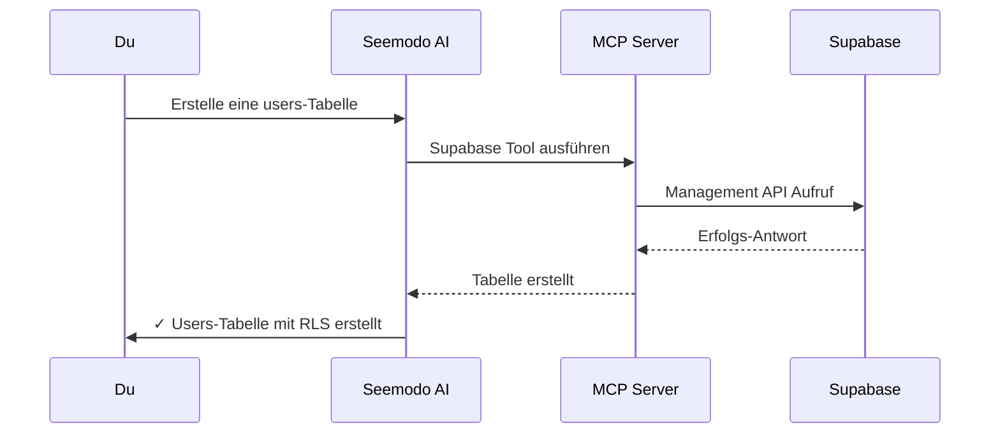

Seemodo Cloud integriert dein Supabase-Projekt direkt in den KI-Entwicklungs-Workflow. Dies ermöglicht der KI Datenbank-Tabellen, Authentifizierung, Storage und mehr zu erstellen und zu verwalten.

## Übersicht

Wenn du Seemodo Cloud verbindest, erhält die KI Zugriff auf:

<CardGroup cols={2}>
  <Card title="Datenbank" icon="database">
    Tabellen erstellen, Queries ausführen, Daten verwalten, Beziehungen einrichten.
  </Card>
  <Card title="Authentifizierung" icon="lock">
    Auth-Provider konfigurieren, Benutzer verwalten, Sessions einrichten.
  </Card>
  <Card title="Storage" icon="folder">
    Buckets erstellen, Dateien hochladen, Zugriffs-Policies konfigurieren.
  </Card>
  <Card title="Edge Functions" icon="bolt">
    Serverless Functions direkt aus der Sandbox deployen.
  </Card>
</CardGroup>

## Einrichtung

### Voraussetzungen

Du brauchst ein Supabase-Projekt mit einem **Management API Token**:

1. Gehe zu deinem [Supabase Dashboard](https://supabase.com/dashboard)
2. Navigiere zu **Account** → **Access Tokens**
3. Erstelle einen neuen Token mit passenden Berechtigungen
4. Kopiere den Token

<Warning>
  Halte deinen Management API Token sicher. Er bietet vollen Zugriff auf dein Supabase-Projekt.
</Warning>

### Seemodo Cloud verbinden

<Steps>
  <Step title="Screen generieren">
    Erstelle zunächst eine Sandbox durch Generierung eines Screens im HiFi-Modus.
  </Step>
  <Step title="Seemodo Cloud öffnen">
    Klicke den **Cloud** Button (Cloud-Icon) neben dem Terminal-Button.
  </Step>
  <Step title="Credentials eingeben">
    - **Projekt-Referenz**: Deine Supabase Projekt-ID (z.B. `abcdefghijklmnop`)
    - **Management API Token**: Der Token aus deinem Supabase Dashboard
  </Step>
  <Step title="Aktivieren">
    Klicke **Cloud aktivieren**. Seemodo wird:
    - Deine Credentials validieren
    - API-Schlüssel deines Projekts abrufen
    - Den KI MCP (Model Context Protocol) Server konfigurieren
    - Supabase-Guidelines in die Sandbox kopieren
  </Step>
</Steps>

Nach der Aktivierung siehst du eine Erfolgsmeldung und der Cloud-Button wird hervorgehoben.

## Seemodo Cloud nutzen

Nach der Aktivierung bitte die KI einfach mit deinem Backend zu arbeiten:

### Datenbank-Operationen

```
Erstelle eine users-Tabelle mit:
- id (uuid, primary key)
- email (text, unique)
- full_name (text)
- avatar_url (text, nullable)
- created_at (timestamp with timezone)
Aktiviere Row Level Security
```

```
Füge eine posts-Tabelle hinzu die users referenziert:
- id, user_id (foreign key), title, content, published_at
```

```
Query alle Benutzer die sich in den letzten 7 Tagen registriert haben
```

### Authentifizierung

```
Richte Email/Passwort-Authentifizierung ein mit:
- Email-Bestätigung erforderlich
- Passwort minimum 8 Zeichen
- Session-Dauer 7 Tage
```

```
Konfiguriere Google OAuth für das Projekt
```

### Storage

```
Erstelle einen öffentlichen 'avatars' Bucket für Benutzer-Profilbilder
Setze maximale Dateigröße auf 2MB, erlaube nur Bild-Typen
```

```
Erstelle einen privaten 'documents' Bucket mit benutzerbasiertem Zugriff
```

### RLS Policies

```
Erstelle RLS-Policies für die posts-Tabelle:
- Benutzer können alle veröffentlichten Posts lesen
- Benutzer können nur ihre eigenen Posts aktualisieren/löschen
- Benutzer können nur Posts mit ihrer eigenen user_id einfügen
```

## Wie es funktioniert



Die KI nutzt das Model Context Protocol (MCP) zur Kommunikation mit Supabase. Dies bietet:

- **Typsichere Operationen**: Die KI weiß genau was möglich ist
- **Direkter Zugriff**: Keine intermediäre API-Schicht
- **Echtzeit-Feedback**: Sofortige Bestätigung von Änderungen

## Best Practices

<AccordionGroup>
  <Accordion title="Immer RLS aktivieren">
    Bitte die KI Row Level Security auf jeder Tabelle zu aktivieren. Sie erstellt automatisch passende Policies.
  </Accordion>
  <Accordion title="Beschreibende Namen verwenden">
    Klare Tabellen- und Spaltennamen helfen der KI dein Datenmodell zu verstehen.
  </Accordion>
  <Accordion title="Migrationen anfordern">
    Für Produktions-Apps bitte die KI Migrations-Dateien statt direkter Schema-Änderungen zu erstellen.
  </Accordion>
  <Accordion title="Policies testen">
    Nach Erstellung von RLS-Policies bitte die KI sie mit verschiedenen Benutzer-Szenarien zu testen.
  </Accordion>
</AccordionGroup>

## Supabase Client Integration

Wenn Seemodo Cloud aktiv ist, erstellt die KI automatisch:

1. `src/lib/supabase.ts` mit deiner Client-Konfiguration
2. Nutzt Umgebungsvariablen für Credentials
3. Implementiert passende TypeScript-Typen

Beispiel generierter Client:

```typescript src/lib/supabase.ts
import { createClient } from '@supabase/supabase-js';

const supabaseUrl = import.meta.env.VITE_SUPABASE_URL;
const supabaseAnonKey = import.meta.env.VITE_SUPABASE_ANON_KEY;

export const supabase = createClient(supabaseUrl, supabaseAnonKey);
```

<Note>
  Die KI verwendet immer `pnpm` für Paket-Installation in der Sandbox. Wenn du npm-Befehle siehst, wird die KI automatisch pnpm verwenden.
</Note>

## Problemlösung

<AccordionGroup>
  <Accordion title="Verbindung fehlgeschlagen">
    - Verifiziere dass deine Projekt-Referenz korrekt ist (nur die ID, nicht volle URL)
    - Prüfe ob dein API-Token gültig ist und nötige Berechtigungen hat
    - Stelle sicher dass dein Supabase-Projekt aktiv ist (nicht pausiert)
  </Accordion>
  <Accordion title="Operationen schlagen fehl">
    - Prüfe das Supabase Dashboard auf Fehler-Logs
    - Verifiziere dass RLS-Policies die Operation nicht blockieren
    - Bitte die KI die spezifische Fehlermeldung zu debuggen
  </Accordion>
  <Accordion title="Fehlende Tabellen">
    - Aktualisiere das Supabase Dashboard
    - Tabellen werden standardmäßig im `public` Schema erstellt
    - Prüfe ob Migrationen ausstehen
  </Accordion>
</AccordionGroup>

## Sicherheitsüberlegungen

<Warning>
  **Nur für Entwicklung**: Seemodo Cloud ist für Entwicklung und Prototyping konzipiert. Für Produktion:
  
  - Niemals deinen Management API Token offenlegen
  - Immer Umgebungsvariablen für Credentials nutzen
  - Alle KI-generierten RLS-Policies prüfen
  - Authentifizierungs-Flows gründlich testen
</Warning>

### Token-Berechtigungen

Dein Management API Token sollte diese Mindest-Berechtigungen haben:

- Database: Read & Write
- Auth: Read & Write (wenn Auth-Features genutzt werden)
- Storage: Read & Write (wenn Storage genutzt wird)
- Edge Functions: Read & Write (wenn Functions deployed werden)

### Datenschutz

- API-Tokens werden im localStorage deines Browsers gespeichert
- Tokens werden nur an dein Supabase-Projekt gesendet, nicht an Seemodo-Server
- Cloud-Verbindung mit dem Disconnect-Button trennen wenn fertig
