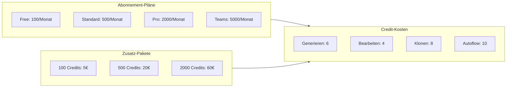

Seemodo verwendet ein Credit-System zur Verwaltung der Nutzung verschiedener Aktionen. Credits werden verbraucht wenn du Screens generierst, Code bearbeitest oder Websites klonst.

## Wie Credits funktionieren

Jede Aktion in Seemodo kostet eine bestimmte Anzahl Credits:

| Aktion | Credit-Kosten | Beschreibung |
|--------|---------------|--------------|
| Screen generieren | 6 Credits | Neuen Screen aus Prompt erstellen |
| Screen bearbeiten | 4 Credits | Bestehenden Screen modifizieren |
| Website klonen | 8 Credits | Website-Design klonen |
| Autoflow | 10 Credits | Mehrere zusammenhängende Screens generieren |
| KI-Chat-Nachricht | 1-2 Credits | Mit dem KI-Coder interagieren |

## Abonnement-Pläne

<CardGroup cols={2}>
  <Card title="Free" icon="gift">
    **100 Credits/Monat**
    
    Perfekt zum Ausprobieren von Seemodo:
    - ~16 Screen-Generierungen
    - Basis KI-Chat
    - Community-Support
  </Card>
  <Card title="Standard" icon="star">
    **500 Credits/Monat**
    
    Für einzelne Entwickler:
    - ~83 Screen-Generierungen
    - Prioritäts-Warteschlange
    - E-Mail-Support
  </Card>
  <Card title="Pro" icon="rocket">
    **2.000 Credits/Monat**
    
    Für professionelle Nutzung:
    - ~333 Screen-Generierungen
    - Deep Design Modus
    - Max Mode Zugang
    - Prioritäts-Support
  </Card>
  <Card title="Teams" icon="users">
    **5.000 Credits/Monat**
    
    Für Teams und Agenturen:
    - ~833 Screen-Generierungen
    - Team-Mitglieder-Verwaltung
    - Geteilter Credit-Pool
    - Dedizierter Support
  </Card>
</CardGroup>

## Credit-Pakete

Mehr Credits benötigt? Kaufe zusätzliche Pakete:

| Paket | Credits | Preis | Pro Credit |
|-------|---------|-------|------------|
| Starter | 100 | 5€ | 0,05€ |
| Growth | 500 | 20€ | 0,04€ |
| Scale | 2.000 | 60€ | 0,03€ |

<Note>
  Credit-Pakete verfallen nie und werden auf deine monatlichen Abonnement-Credits addiert.
</Note>

## Credit-Ablauf

## Guthaben überprüfen

Sieh dir dein aktuelles Credit-Guthaben an:

1. Öffne die Seemodo-App
2. Schau auf den **Generierungen** Zähler in der Seitenleiste
3. Oder gehe zu `/account` für detaillierte Nutzung

Der Generierungszähler zeigt deine gesamten erfolgreichen Generierungen. Deine verbleibenden Credits werden im Account-Dashboard angezeigt.

## Credit-Spar-Tipps

<AccordionGroup>
  <Accordion title="Wireframe-Modus zur Exploration nutzen">
    Der Wireframe-Modus verbraucht keine Credits - nutze ihn um Ideen zu erkunden bevor du HiFi-Generierung commitest.
  </Accordion>
  <Accordion title="Prompts vor Generierung verfeinern">
    Nimm dir Zeit für einen detaillierten Prompt. Eine gute Generierung ist besser als mehrere Versuche.
  </Accordion>
  <Accordion title="KI-Chat für kleine Änderungen nutzen">
    Kleine Änderungen via KI-Chat (1-2 Credits) sind günstiger als den ganzen Screen neu zu generieren (6 Credits).
  </Accordion>
  <Accordion title="Autoflow für zusammenhängende Screens nutzen">
    Autoflow (10 Credits) ist effizienter als 5 Screens separat zu generieren (30 Credits).
  </Accordion>
  <Accordion title="Referenzbilder hochladen">
    Referenzbilder helfen der KI deine Vision zu verstehen und reduzieren die Notwendigkeit mehrerer Versuche.
  </Accordion>
</AccordionGroup>

## Enterprise-Pläne

Für hohe Nutzungsvolumen oder individuelle Anforderungen:

- **Unbegrenzte Credits**
- Individuelle KI-Modell-Konfiguration
- Dedizierte Sandbox-Infrastruktur
- SLA-Garantien
- On-Premise Deployment-Optionen

Kontaktiere sales@seemodo.ai für Enterprise-Preise.

## FAQ

<AccordionGroup>
  <Accordion title="Werden Credits übertragen?">
    Abonnement-Credits werden monatlich zurückgesetzt. Gekaufte Credit-Pakete verfallen nie.
  </Accordion>
  <Accordion title="Was passiert wenn ich keine mehr habe?">
    Du kannst bestehende Projekte weiterhin ansehen und herunterladen. Generierung ist pausiert bis Credits erneuert werden oder du mehr kaufst.
  </Accordion>
  <Accordion title="Kann ich Credits mit meinem Team teilen?">
    Der Teams-Plan beinhaltet geteilte Credit-Pools. Jedes Team-Mitglied zieht vom gleichen Guthaben.
  </Accordion>
  <Accordion title="Gibt es Rückerstattungen?">
    Fehlgeschlagene Generierungen verbrauchen keine Credits. Wenn eine Generierung durch einen Systemfehler fehlschlägt, werden deine Credits automatisch erstattet.
  </Accordion>
</AccordionGroup>
