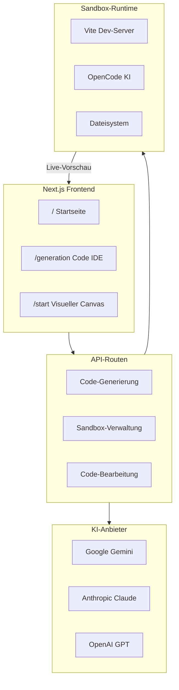

Seemodo ist eine KI-gestützte Full-Stack-Entwicklungsplattform, die schnelle Anwendungserstellung durch mehrere Modalitäten ermöglicht. Erstelle komplette React-Anwendungen in Minuten statt Stunden.

## Was ist Seemodo?

Seemodo ist ein KI-Coding-Assistent, der deine Ideen in funktionierende Anwendungen verwandelt. Ob du beschreibst was du möchtest, visuell auf einem Canvas designst oder eine bestehende Website klonst - Seemodo generiert produktionsreifen React-Code mit Tailwind CSS Styling.

<CardGroup cols={2}>
  <Card title="Text-zu-App" icon="message">
    Beschreibe was du möchtest und erhalte sofort eine funktionierende React-Anwendung.
  </Card>
  <Card title="Visuelles Design" icon="paintbrush">
    Nutze den Canvas-basierten Designer um Screens visuell mit tldraw zu erstellen.
  </Card>
  <Card title="Website-Klonen" icon="clone">
    Klone jedes Website-Design sofort mit Firecrawl-Integration.
  </Card>
  <Card title="KI-Chat-Editor" icon="comments">
    Verfeinere deine App iterativ durch natürlichsprachliche Konversation.
  </Card>
</CardGroup>

## Hauptfunktionen

### Multi-Modell KI-Unterstützung

Seemodo unterstützt mehrere KI-Anbieter für maximale Flexibilität:

| Modell | Anbieter | Beste Verwendung |
|--------|----------|------------------|
| Gemini 3 Pro | Google | Standard, ausgewogene Leistung |
| Claude Sonnet 4 | Anthropic | Komplexes Reasoning |
| GPT-5 | OpenAI | Allgemeine Zwecke |
| Kimi K2 | Groq | Schnelle Inferenz |

### Live Sandbox-Vorschau

Jede generierte Anwendung läuft in einer echten Sandbox-Umgebung mit:

- **Hot Module Replacement (HMR)** - Änderungen sofort sehen
- **Vollständiger Vite Dev-Server** - Echte Entwicklungsumgebung
- **Paket-Management** - Automatische Erkennung und Installation von npm-Abhängigkeiten
- **Fehler-Wiederherstellung** - KI behebt Build-Fehler automatisch

### Seemodo Cloud

Verbinde dein Supabase-Projekt für volle Backend-Funktionalität:

- Datenbank-Management
- Authentifizierung
- Storage
- Edge Functions
- Row Level Security Policies

## Erste Schritte

<Steps>
  <Step title="Seemodo öffnen">
    Navigiere zur Seemodo-App unter `http://app.seemodo.ai` oder deiner bereitgestellten URL.
  </Step>
  <Step title="Prompt eingeben">
    Beschreibe was du erstellen möchtest, oder füge eine URL zum Klonen ein.
  </Step>
  <Step title="Generieren">
    Klicke auf Generieren und beobachte wie deine App in der Live-Vorschau entsteht.
  </Step>
  <Step title="Mit KI iterieren">
    Nutze den KI-Chat um deine Anwendung zu verfeinern und zu erweitern.
  </Step>
</Steps>

## Architektur-Übersicht

## Nächste Schritte

<CardGroup cols={2}>
  <Card title="Schnellstart" icon="play" href="/de/seemodo/getting-started">
    Richte Seemodo ein und generiere deine erste App.
  </Card>
  <Card title="KI-Coder Anleitung" icon="robot" href="/de/seemodo/ai-coder">
    Lerne wie du das KI-Chat-Interface effektiv nutzt.
  </Card>
  <Card title="Visueller Designer" icon="palette" href="/de/seemodo/visual-designer">
    Meistere die Canvas-basierten visuellen Design-Tools.
  </Card>
  <Card title="Seemodo Cloud" icon="cloud" href="/de/seemodo/cloud">
    Verbinde Supabase für Backend-Funktionalität.
  </Card>
</CardGroup>
