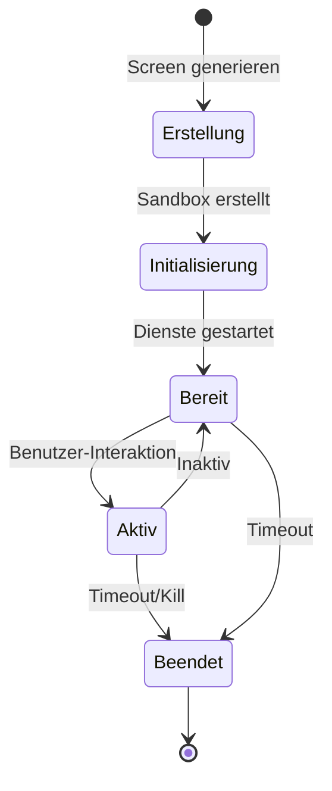
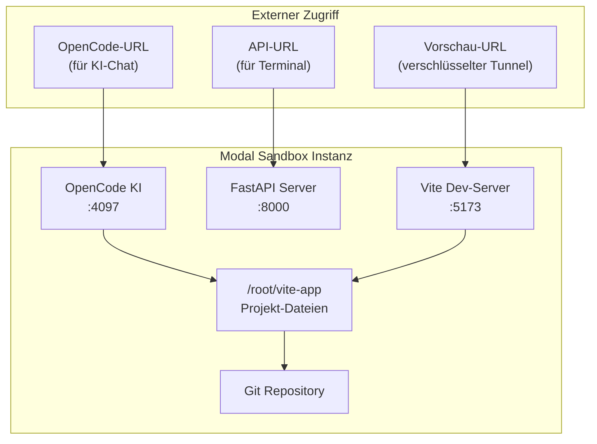

Seemodo verwendet Cloud-Sandboxes um deine generierten Anwendungen auszuführen. Jede Sandbox bietet eine vollständige Entwicklungsumgebung mit Vite Dev-Server, Paket-Management und KI-Integration.

## Verfügbare Anbieter

<Tabs>
  <Tab title="Modal (Empfohlen)">
    **Schnelle, skalierbare Cloud-Sandboxes mit voller KI-Integration**

    Modal Labs bietet vorkonfigurierte Sandboxes optimiert für Seemodo:

    | Feature | Details |
    |---------|---------|
    | Timeout | 1-24 Stunden (konfigurierbar) |
    | Paket-Manager | pnpm |
    | KI-Integration | OpenCode Server integriert |
    | Git | Auto-Commit nach KI-Änderungen |
    | Vorschau | Verschlüsselte Tunnel-URLs |

    **Integrierte Dienste:**
    - Vite Dev-Server (Port 5173)
    - FastAPI Server (Port 8000)
    - OpenCode KI-Server (Port 4097)

    **Setup:**
    ```bash
    cd modal-backend
    pip install modal
    modal setup
    modal deploy main.py
    ```

    Zu `.env` hinzufügen:
    ```env
    SANDBOX_PROVIDER=modal
    MODAL_BACKEND_URL=https://deine-deployed-url.modal.run
    ```
  </Tab>
  <Tab title="E2B">
    **Sichere Sandboxes für Code-Ausführung**

    E2B bietet isolierte Sandboxes mit vollem Dateisystem-Zugriff:

    | Feature | Details |
    |---------|---------|
    | Timeout | 60 Minuten |
    | Paket-Manager | npm |
    | KI-Integration | Nur extern |
    | Vorschau | Port 5173 |

    **Setup:**
    
    Hole einen API-Schlüssel von [e2b.dev](https://e2b.dev) und füge zu `.env` hinzu:
    ```env
    SANDBOX_PROVIDER=e2b
    E2B_API_KEY=dein_e2b_api_key
    ```
  </Tab>
  <Tab title="Vercel Sandbox">
    **Native Next.js-Unterstützung mit Vercel-Infrastruktur**

    Optimiert für Next.js-Anwendungen:

    | Feature | Details |
    |---------|---------|
    | Timeout | 15 Minuten |
    | Paket-Manager | npm |
    | Framework | Next.js nativ |
    | Vorschau | Port 3000 |

    **Setup:**
    ```env
    SANDBOX_PROVIDER=vercel
    ```

    <Note>
      Vercel Sandbox ist am besten für Next.js-spezifische Anwendungen geeignet.
    </Note>
  </Tab>
</Tabs>

## Anbieter-Vergleich

| Feature | Modal | E2B | Vercel |
|---------|-------|-----|--------|
| Standard-Timeout | 1 Stunde | 60 Min | 15 Min |
| Max Timeout | 24 Stunden | 60 Min | 15 Min |
| OpenCode KI | ✅ Integriert | ❌ | ❌ |
| Git-Integration | ✅ Auto-Commit | ❌ | ❌ |
| Paket-Manager | pnpm | npm | npm |
| Startzeit | ~5 Sekunden | ~10 Sekunden | ~3 Sekunden |
| Beste Verwendung | Voller KI-Workflow | Schnelle Prototypen | Next.js Apps |

## Sandbox-Lebenszyklus



### Sandbox erstellen

Eine Sandbox wird automatisch erstellt wenn du:

1. Einen HiFi-Screen generierst
2. Generate Flow mit HiFi-Modus klickst

Der Prozess:
1. Neue Sandbox vom Anbieter anfordern
2. Auf Container-Start warten
3. Vite Dev-Server initialisieren
4. OpenCode KI starten (nur Modal)
5. Vorschau-URL zurückgeben

### Sandbox-Zustände

| Zustand | Beschreibung |
|---------|--------------|
| **Initialisierung** | Sandbox startet |
| **Bereit** | Alle Dienste laufen, Vorschau verfügbar |
| **Aktiv** | Benutzer interagiert mit Sandbox |
| **Inaktiv** | Keine kürzliche Aktivität |
| **Beendet** | Sandbox wurde gestoppt |

## Modal Sandbox Architektur



### Vorinstalliertes Template

Modal-Sandboxes kommen mit vorkonfiguriertem Vite + React + Tailwind Template:

```
/root/vite-app/
├── src/
│   ├── main.jsx
│   ├── App.jsx
│   └── index.css
├── public/
├── index.html
├── package.json
├── vite.config.js
├── tailwind.config.js
└── postcss.config.js
```

## Konfiguration

Alle Sandbox-Einstellungen sind in `config/app.config.ts`:

```typescript
export const appConfig = {
  // Modal Konfiguration
  modal: {
    timeoutMinutes: 60,
    backendUrl: process.env.MODAL_BACKEND_URL,
    vitePort: 5173,
    viteStartupDelay: 5000,
    workingDirectory: '/root/vite-app',
  },
  
  // E2B Konfiguration
  e2b: {
    timeoutMinutes: 60,
    vitePort: 5173,
    viteStartupDelay: 10000,
    workingDirectory: '/home/user/app',
  },
  
  // Vercel Konfiguration
  vercelSandbox: {
    timeoutMinutes: 15,
    devPort: 3000,
    devServerStartupDelay: 7000,
    workingDirectory: '/app',
  },
};
```

## Terminal-Zugriff

Öffne das Terminal um Befehle direkt in der Sandbox auszuführen:

1. Klicke den **Terminal** Button nachdem eine Sandbox aktiv ist
2. Nutze das eingebaute Terminal oder KI-Chat

Häufige Befehle:
```bash
# Dateien anzeigen
ls -la src/

# Paket installieren
pnpm add lodash

# Nach Fehlern suchen
cat vite.log

# Git-Historie anzeigen
git log --oneline
```

## Projekt herunterladen

Exportiere dein Projekt als ZIP-Datei:

1. Öffne das Sandbox-Panel
2. Klicke den **Download** Button
3. Erhalte eine vollständige ZIP mit:
   - Allen Quelldateien
   - `package.json` mit Abhängigkeiten
   - Konfigurations-Dateien
   - Git-Historie (nur Modal)

Heruntergeladenes Projekt lokal ausführen:
```bash
unzip project.zip
cd project
pnpm install
pnpm dev
```

## Problemlösung

<AccordionGroup>
  <Accordion title="Sandbox startet nicht">
    - Prüfe ob dein Anbieter-API-Key/URL korrekt ist
    - Verifiziere dass Modal-Backend deployed ist
    - Prüfe Netzwerk-Konnektivität
    - Browser-Konsole auf Fehler prüfen
  </Accordion>
  <Accordion title="Vorschau lädt nicht">
    - Warte auf Vite-Server-Start (kann 5-10 Sekunden dauern)
    - Prüfe auf Build-Fehler in den Logs
    - Stelle sicher dass Sandbox nicht abgelaufen ist
    - Vorschau-iframe aktualisieren versuchen
  </Accordion>
  <Accordion title="Pakete werden nicht installiert">
    - Verifiziere dass Paket-Name korrekt ist
    - Prüfe auf Netzwerk-Probleme in der Sandbox
    - Nutze `pnpm` statt `npm` (Modal)
    - Vite nach Installation neustarten
  </Accordion>
  <Accordion title="KI verbindet nicht">
    - Stelle sicher dass du Modal-Provider nutzt
    - Warte auf vollständige Sandbox-Initialisierung
    - Prüfe ob OpenCode-URL verfügbar ist
    - Panel auf Verbindungsfehler prüfen
  </Accordion>
</AccordionGroup>

## Umgebungsvariablen

Sandboxes unterstützen Umgebungsvariablen für:

- API-Schlüssel (für externe Dienste)
- Konfigurations-Flags
- Feature-Toggles

Erstelle eine `.env` Datei in der Sandbox oder bitte die KI Umgebungsvariablen einzurichten.

<Warning>
  Niemals echte API-Schlüssel in generiertem Code committen. Nutze Umgebungsvariablen und `.env` Dateien.
</Warning>
