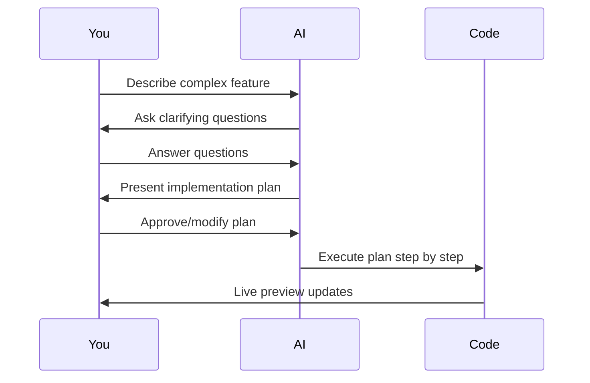

The AI Coder (powered by OpenCode) is Seemodo's intelligent coding assistant. It can read files, write code, run commands, and automatically fix errors - all through natural language conversation.

## Overview

The AI Coder panel appears in the Sandbox Panel after generating a screen or creating a sandbox. It provides two interaction modes:

<Tabs>
  <Tab title="Agent Mode">
    **Direct coding assistance** - The AI immediately takes action on your requests.

    Best for:
    - Quick changes and fixes
    - Adding single features
    - Debugging issues
    - File operations

    The AI can:
    - Read and analyze code files
    - Write new files or edit existing ones
    - Run terminal commands
    - Install npm packages
    - Auto-commit changes to git
  </Tab>
  <Tab title="Plan Mode">
    **Interactive brainstorming** - The AI guides you through a planning process before coding.

    Best for:
    - Complex multi-step features
    - Architectural decisions
    - New project scaffolding
    - Features with many options

    The AI will:
    - Ask clarifying questions
    - Present options for you to choose
    - Build a structured implementation plan
    - Execute the plan after approval
  </Tab>
</Tabs>

## Using Agent Mode

### Basic Workflow

1. **Open the Sandbox Panel** by clicking the Terminal button after generating a screen
2. **Ensure you're in Agent mode** (default)
3. **Type your request** in natural language
4. **Watch the AI work** - see files being read/written, commands executed
5. **Preview changes** in the live sandbox

### Example Requests

<AccordionGroup>
  <Accordion title="Adding features">
    ```
    Add a dark mode toggle to the header that persists to localStorage
    ```

    ```
    Create a loading skeleton for the user list component
    ```

    ```
    Add form validation to the signup form with error messages
    ```
  </Accordion>

  <Accordion title="Editing existing code">
    ```
    Change the primary button color from blue to purple
    ```

    ```
    Make the sidebar collapsible on mobile screens
    ```

    ```
    Add smooth transitions to all button hover states
    ```
  </Accordion>

  <Accordion title="Debugging">
    ```
    Fix the TypeScript error in the Header component
    ```

    ```
    The user list isn't loading - can you check what's wrong?
    ```

    ```
    There's a layout issue on mobile, please investigate
    ```
  </Accordion>

  <Accordion title="Package installation">
    ```
    Install framer-motion and add page transition animations
    ```

    ```
    Add react-hook-form for better form handling
    ```

    ```
    Install and configure zustand for state management
    ```
  </Accordion>
</AccordionGroup>

### Tool Indicators

The AI shows what tools it's using in real-time:

| Icon | Tool | Description |
|------|------|-------------|
| 👁️ | Read | Reading a file |
| ✏️ | Edit | Modifying a file |
| 📝 | Write | Creating a new file |
| 🖥️ | Bash | Running a terminal command |
| 🔍 | Search | Searching the codebase |
| ✅ | Done | Tool completed successfully |

Click on any tool action to expand and see details.

## Using Plan Mode

Plan Mode is designed for complex requests that benefit from discussion before implementation.

### How It Works



### Question Types

The AI may ask various types of questions:

<CardGroup cols={2}>
  <Card title="Pick One" icon="circle-check">
    Choose a single option from multiple choices.
  </Card>
  <Card title="Pick Many" icon="check-double">
    Select multiple options that apply.
  </Card>
  <Card title="Text Input" icon="keyboard">
    Provide free-form text response.
  </Card>
  <Card title="Confirm" icon="thumbs-up">
    Yes/no confirmation for a decision.
  </Card>
  <Card title="Rate" icon="star">
    Rate something on a scale.
  </Card>
  <Card title="Slider" icon="sliders">
    Set a value along a range.
  </Card>
</CardGroup>

### Example Session

```
You: Build a complete user authentication system

AI: I'll help you build authentication. A few questions first:

Q1: Which authentication methods do you need?
   ☑️ Email/Password
   ☑️ Google OAuth
   ☐ GitHub OAuth
   ☐ Magic Link
   
Q2: Do you need role-based access control?
   ○ Yes, with admin and user roles
   ● No, all users have the same permissions
   
Q3: Where should users be redirected after login?
   [Dashboard]

AI: Great! Here's the plan:
1. Create auth context with login/logout functions
2. Build login and signup forms
3. Add Google OAuth integration
4. Create protected route wrapper
5. Add user menu in header

Ready to execute? [Execute Plan]
```

## Reference Images

Upload images to provide visual context for the AI:

1. Click the **image icon** in the chat input
2. Select one or more images
3. Add your prompt describing what you want
4. The AI will use the images as reference

<Tip>
  Reference images are especially useful for:
  - Matching a specific design style
  - Recreating UI from screenshots
  - Implementing mockups from Figma
</Tip>

## Selected Component Context

Use **React Grab** to select components directly in the preview:

1. Enable React Grab mode in the preview toolbar
2. Click on any component in the preview
3. The component's code context is automatically attached to your next message
4. Ask the AI to modify that specific component

```
[Selected Component: Button in src/components/ui/Button.tsx]

Make this button have a gradient background and a subtle shadow
```

## Auto Features

### Auto Commit

After the AI makes file changes, it automatically creates a git commit with a descriptive message. This gives you a complete history of all AI-assisted changes.

View commit history:
```bash
git log --oneline
```

### Auto Package Detection

When the AI writes code that imports new packages, they're automatically detected and installed. You'll see a notification when packages are being installed.

### Error Recovery

If a Vite build error occurs, the AI:
1. Detects the error automatically
2. Reads the relevant file
3. Fixes the issue
4. Verifies the fix worked

## Model Selection

When the model selector is enabled (`?model=true` in URL), you can choose which AI model handles your requests:

| Model | Strengths |
|-------|-----------|
| **Gemini 3 Pro** | Balanced, good default choice |
| **Claude Sonnet 4** | Excellent for complex reasoning |
| **GPT-5** | Strong general performance |
| **Kimi K2** | Fast responses via Groq |

<Note>
  The model selector is only visible when `?model=true` is added to the URL.
</Note>

## Tips for Best Results

<Steps>
  <Step title="Be specific">
    Instead of "make it look better", say "add rounded corners, shadows, and a gradient background".
  </Step>
  <Step title="Provide context">
    Mention file names when you know them: "in the Header component, add..."
  </Step>
  <Step title="Use Plan Mode for complexity">
    For features touching multiple files, Plan Mode ensures thorough implementation.
  </Step>
  <Step title="Iterate in small steps">
    Multiple small requests often work better than one large request.
  </Step>
  <Step title="Upload reference images">
    Visual examples help the AI understand exactly what you want.
  </Step>
</Steps>

## Supabase Integration

When [Seemodo Cloud](/seemodo/cloud) is connected, the AI has direct access to your Supabase project:

- Create and modify database tables
- Set up authentication
- Configure storage buckets
- Write Edge Functions
- Create RLS policies

All Supabase operations use the MCP (Model Context Protocol) for seamless integration.
