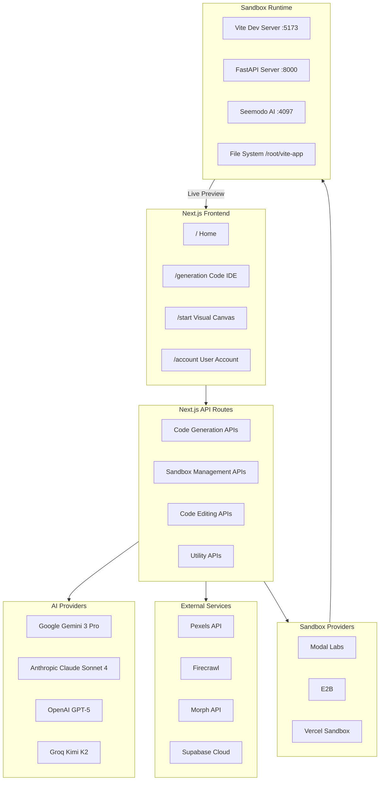
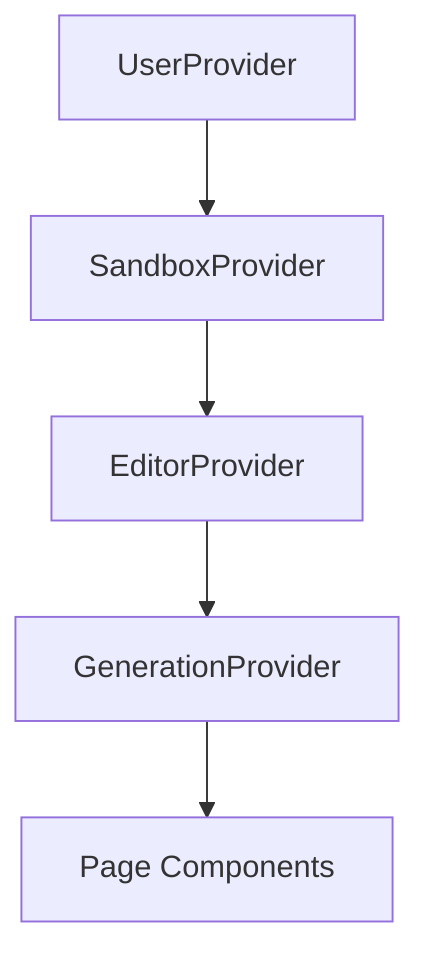
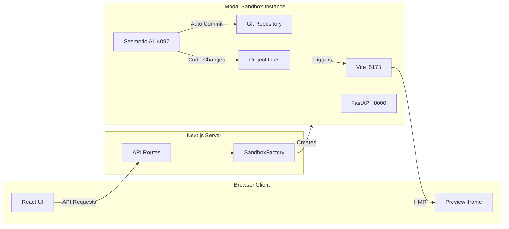
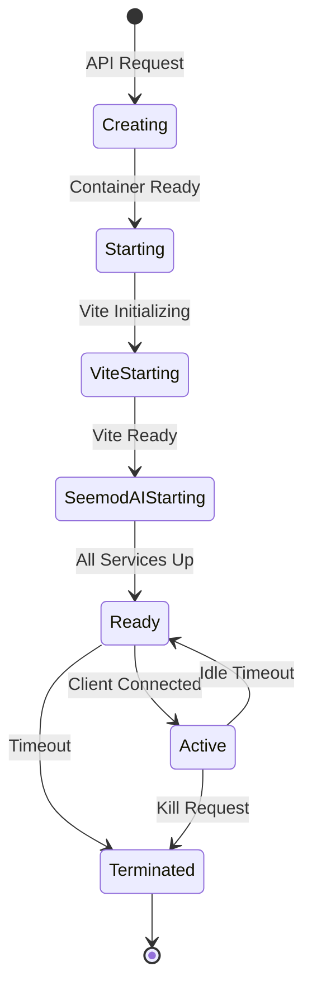
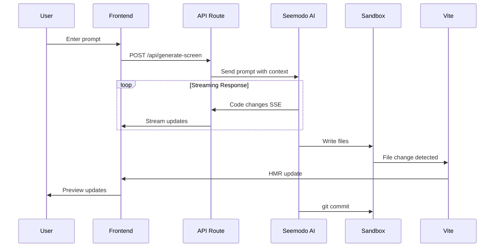
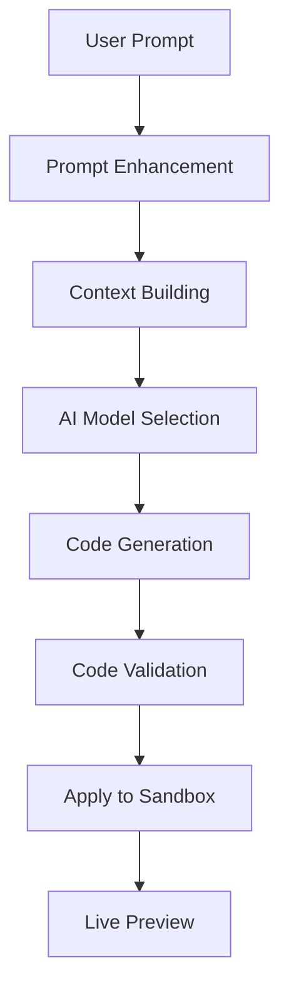
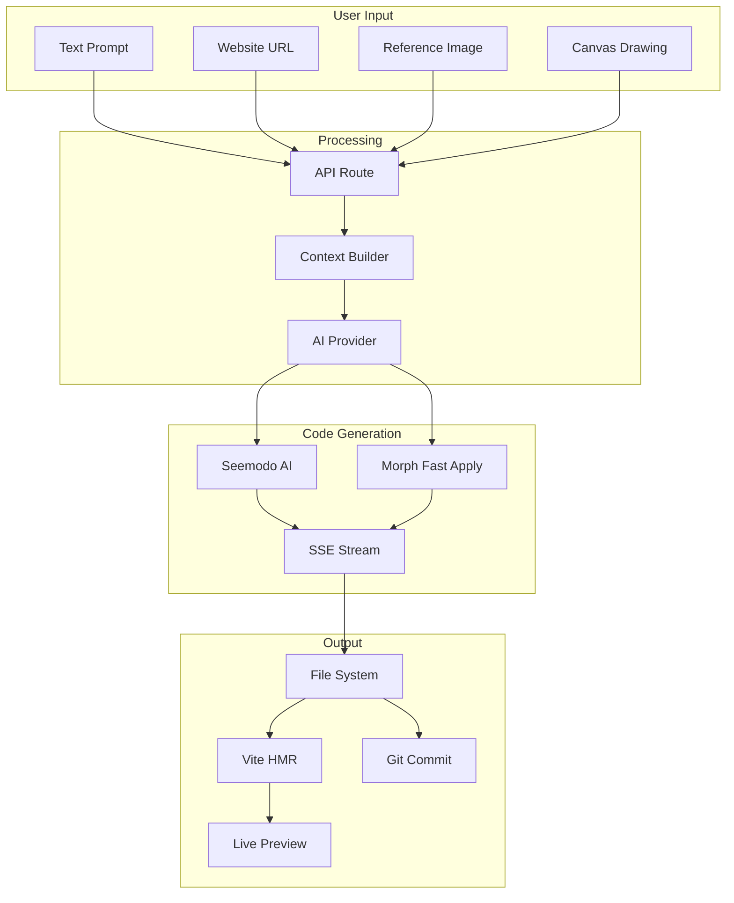

This document provides a comprehensive technical overview of Seemodo's architecture for developers who want to understand or extend the system.

## System Overview



## Frontend Architecture

### Pages

| Route | Component | Purpose |
|-------|-----------|---------|
| `/` | `app/page.tsx` | Minimal home with prompt input |
| `/start` | `app/start/page.tsx` | Visual canvas designer |
| `/generation` | `app/generation/page.tsx` | Full code IDE |
| `/account` | `app/account/page.tsx` | User account management |

### Context Providers

The app uses nested React Context for state management:



| Context | Purpose | Key State |
|---------|---------|-----------|
| `UserProvider` | User authentication and profile | User data, auth state |
| `SandboxProvider` | Sandbox lifecycle management | Sandbox ID, URLs, pages |
| `EditorProvider` | Code editing state | Current file, editor content |
| `GenerationProvider` | Generation state | Generated screens, prompts |

### Key Components

```
app/start/
├── page.tsx              # Main page with providers
├── components/
│   ├── TopHeader.tsx     # Navigation header
│   ├── LeftSidebar.tsx   # Prompt and settings
│   ├── TldrawCanvas.tsx  # tldraw integration
│   ├── SandboxPanel.tsx  # Preview and terminal
│   ├── SeemodAIPanel.tsx # AI chat interface
│   ├── ModelSelector.tsx # AI model selection
│   └── brainstorm/       # Plan mode components
└── lib/
    ├── sandbox-context.tsx
    ├── generation-context.tsx
    └── editor-context.tsx
```

## Sandbox Architecture

### Provider Factory Pattern

```typescript
// lib/sandbox/factory.ts
export function createSandboxProvider(): SandboxProvider {
  const provider = process.env.SANDBOX_PROVIDER || 'modal';
  
  switch (provider) {
    case 'modal':
      return new ModalProvider();
    case 'e2b':
      return new E2BProvider();
    case 'vercel':
      return new VercelProvider();
    default:
      throw new Error(`Unknown provider: ${provider}`);
  }
}
```

### Modal Sandbox Instance



### Sandbox Lifecycle



## AI Generation Flow

### Code Generation Pipeline



### Prompt Processing



## Seemodo AI Integration

### Client Architecture

```typescript
// Using @opencode-ai/sdk
const client = createOpencodeClient({ baseUrl: opencodeUrl });

// Session management
const session = await client.session.create({
  body: { title: 'Seemodo Session' }
});

// Send prompt
await client.session.prompt({
  path: { id: session.id },
  body: { 
    parts: [{ type: 'text', text: message }],
    model: { providerID: 'vercel', modelID: 'claude-sonnet-4' }
  }
});

// Event stream
const eventSource = new EventSource(`${opencodeUrl}/event`);
eventSource.onmessage = (event) => {
  const data = JSON.parse(event.data);
  // Handle tool calls, text, errors
};
```

### Tool Types

| Tool | Description | Events |
|------|-------------|--------|
| Read | Read file contents | `tool.read.start`, `tool.read.result` |
| Write | Create/overwrite file | `tool.write.result` |
| Edit | Modify file sections | `tool.str_replace.result` |
| Bash | Execute commands | `tool.bash.start`, `tool.bash.result` |
| Search | Search codebase | `tool.search.result` |

## Data Flow

### Generation Request



## Tech Stack

### Frontend

| Technology | Purpose |
|------------|---------|
| Next.js 16 | React framework with App Router |
| TypeScript | Type safety |
| Tailwind CSS | Styling |
| Radix UI | Accessible primitives |
| Shadcn/ui | Component library |
| tldraw | Canvas/wireframe editor |
| Framer Motion | Animations |
| Jotai | Atomic state management |
| xterm.js | Terminal emulator |

### Backend

| Technology | Purpose |
|------------|---------|
| Next.js API Routes | Backend endpoints |
| Vercel AI SDK | AI model integration |
| Modal Labs | Sandbox infrastructure |
| Python/FastAPI | Modal sandbox server |
| Seemodo AI SDK | AI coding assistant |

### External Services

| Service | Purpose |
|---------|---------|
| Google Gemini | Default AI model |
| Anthropic Claude | Alternative AI model |
| OpenAI GPT | Alternative AI model |
| Groq | Fast inference (Kimi K2) |
| Firecrawl | Website scraping |
| Pexels | Stock images |
| Morph | Fast code application |
| Supabase | Backend-as-a-service |

## Project Structure

```
seemodo-app/
├── app/                        # Next.js App Router
│   ├── page.tsx               # Home page
│   ├── layout.tsx             # Root layout
│   ├── start/                 # Visual canvas
│   │   ├── page.tsx
│   │   ├── components/
│   │   └── lib/
│   ├── generation/            # Code IDE
│   ├── account/               # User account
│   └── api/                   # API routes
├── components/                 # Shared components
│   ├── ui/                    # Base UI components
│   └── shared/                # Shared features
├── lib/                       # Utilities and logic
│   ├── sandbox/               # Sandbox providers
│   ├── ai/                    # AI configuration
│   ├── subscription/          # Credits system
│   └── contexts/              # React contexts
├── config/                    # Configuration
│   └── app.config.ts
├── modal-backend/             # Modal sandbox code
│   ├── main.py               # Modal app
│   ├── server.py             # FastAPI server
│   ├── agent.py              # AI agent
│   └── vite-app/             # Template project
├── styles/                    # CSS and design system
└── types/                     # TypeScript types
```

## Security Considerations

### API Keys

- All API keys stored in environment variables
- Never exposed to client-side code
- Separate keys for development/production

### Sandbox Isolation

- Each sandbox runs in isolated container
- No network access between sandboxes
- File system isolation
- Encrypted tunnel URLs

### Authentication

- User sessions via Supabase Auth (when configured)
- API routes validate authentication
- Sandbox credentials per-session

## Scalability

### Horizontal Scaling

- Next.js deploys on Vercel/similar
- Sandboxes scale independently on Modal
- No shared state between requests

### Performance Optimizations

- SSE streaming for real-time updates
- HMR for instant preview updates
- Parallel tool execution in Seemodo AI
- Client-side caching for UI state
