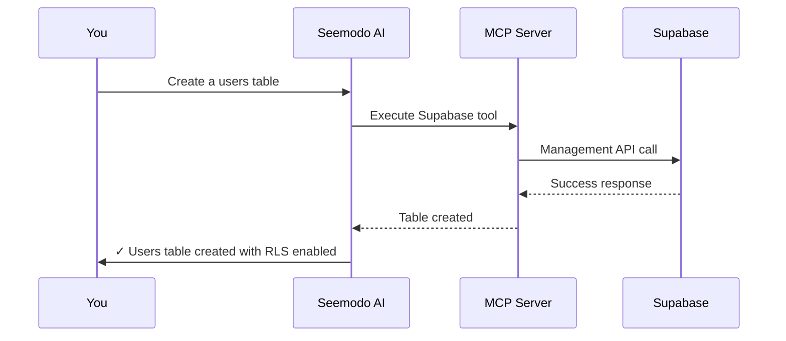

Seemodo Cloud integrates your Supabase project directly into the AI development workflow. This enables the AI to create and manage database tables, authentication, storage, and more.

## Overview

When you connect Seemodo Cloud, the AI gains access to:

<CardGroup cols={2}>
  <Card title="Database" icon="database">
    Create tables, run queries, manage data, set up relationships.
  </Card>
  <Card title="Authentication" icon="lock">
    Configure auth providers, manage users, set up sessions.
  </Card>
  <Card title="Storage" icon="folder">
    Create buckets, upload files, configure access policies.
  </Card>
  <Card title="Edge Functions" icon="bolt">
    Deploy serverless functions directly from the sandbox.
  </Card>
</CardGroup>

## Setting Up

### Prerequisites

You need a Supabase project with a **Management API token**:

1. Go to your [Supabase Dashboard](https://supabase.com/dashboard)
2. Navigate to **Account** → **Access Tokens**
3. Create a new token with appropriate permissions
4. Copy the token

<Warning>
  Keep your Management API token secure. It provides full access to your Supabase project.
</Warning>

### Connecting Seemodo Cloud

<Steps>
  <Step title="Generate a screen">
    First, create a sandbox by generating a screen in HiFi mode.
  </Step>
  <Step title="Open Seemodo Cloud">
    Click the **Cloud** button (cloud icon) next to the Terminal button.
  </Step>
  <Step title="Enter your credentials">
    - **Project Reference**: Your Supabase project ID (e.g., `abcdefghijklmnop`)
    - **Management API Token**: The token from your Supabase dashboard
  </Step>
  <Step title="Activate">
    Click **Activate Cloud**. Seemodo will:
    - Validate your credentials
    - Retrieve your project's API keys
    - Configure the AI's MCP (Model Context Protocol) server
    - Copy Supabase guidelines to the sandbox
  </Step>
</Steps>

Once activated, you'll see a success message and the Cloud button will highlight.

## Using Seemodo Cloud

After activation, simply ask the AI to work with your backend:

### Database Operations

```
Create a users table with:
- id (uuid, primary key)
- email (text, unique)
- full_name (text)
- avatar_url (text, nullable)
- created_at (timestamp with timezone)
Enable Row Level Security
```

```
Add a posts table that references users:
- id, user_id (foreign key), title, content, published_at
```

```
Query all users who signed up in the last 7 days
```

### Authentication

```
Set up email/password authentication with:
- Email confirmation required
- Password minimum 8 characters
- Session duration 7 days
```

```
Configure Google OAuth for the project
```

### Storage

```
Create a public 'avatars' bucket for user profile pictures
Set max file size to 2MB, allow only image types
```

```
Create a private 'documents' bucket with user-based access
```

### RLS Policies

```
Create RLS policies for the posts table:
- Users can read all published posts
- Users can only update/delete their own posts
- Users can only insert posts with their own user_id
```

## How It Works



The AI uses the Model Context Protocol (MCP) to communicate with Supabase. This provides:

- **Type-safe operations**: The AI knows exactly what's possible
- **Direct access**: No intermediary API layer
- **Real-time feedback**: Immediate confirmation of changes

## Best Practices

<AccordionGroup>
  <Accordion title="Always enable RLS">
    Ask the AI to enable Row Level Security on every table. It will create appropriate policies automatically.
  </Accordion>
  <Accordion title="Use descriptive names">
    Clear table and column names help the AI understand your data model.
  </Accordion>
  <Accordion title="Request migrations">
    For production apps, ask the AI to create migration files rather than direct schema changes.
  </Accordion>
  <Accordion title="Test policies">
    After creating RLS policies, ask the AI to test them with different user scenarios.
  </Accordion>
</AccordionGroup>

## Supabase Client Integration

When Seemodo Cloud is active, the AI automatically:

1. Creates `src/lib/supabase.ts` with your client configuration
2. Uses environment variables for credentials
3. Implements proper TypeScript types

Example generated client:

```typescript src/lib/supabase.ts
import { createClient } from '@supabase/supabase-js';

const supabaseUrl = import.meta.env.VITE_SUPABASE_URL;
const supabaseAnonKey = import.meta.env.VITE_SUPABASE_ANON_KEY;

export const supabase = createClient(supabaseUrl, supabaseAnonKey);
```

<Note>
  The AI always uses `pnpm` for package installation in the sandbox. If you see npm commands, the AI will automatically use pnpm instead.
</Note>

## Troubleshooting

<AccordionGroup>
  <Accordion title="Connection failed">
    - Verify your project reference is correct (just the ID, not full URL)
    - Check that your API token is valid and has necessary permissions
    - Ensure your Supabase project is active (not paused)
  </Accordion>
  <Accordion title="Operations failing">
    - Check the Supabase dashboard for error logs
    - Verify RLS policies aren't blocking the operation
    - Ask the AI to debug the specific error message
  </Accordion>
  <Accordion title="Missing tables">
    - Refresh the Supabase dashboard
    - Tables are created in the `public` schema by default
    - Check if migrations are pending
  </Accordion>
</AccordionGroup>

## Security Considerations

<Warning>
  **Development Only**: Seemodo Cloud is designed for development and prototyping. For production:
  
  - Never expose your Management API token
  - Always use environment variables for credentials
  - Review all AI-generated RLS policies
  - Test authentication flows thoroughly
</Warning>

### Token Permissions

Your Management API token should have these minimum permissions:

- Database: Read & Write
- Auth: Read & Write (if using auth features)
- Storage: Read & Write (if using storage)
- Edge Functions: Read & Write (if deploying functions)

### Data Privacy

- API tokens are stored in your browser's localStorage
- Tokens are only sent to your Supabase project, not to Seemodo servers
- Clear cloud connection with the disconnect button when done
