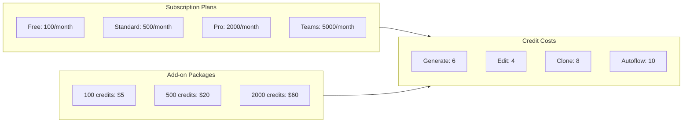

Seemodo uses a credit system to manage usage across different actions. Credits are consumed when you generate screens, edit code, or clone websites.

## How Credits Work

Each action in Seemodo costs a specific number of credits:

| Action | Credit Cost | Description |
|--------|-------------|-------------|
| Generate Screen | 6 credits | Create a new screen from a prompt |
| Edit Screen | 4 credits | Modify an existing screen |
| Clone Website | 8 credits | Clone a website's design |
| Autoflow | 10 credits | Generate multiple related screens |
| AI Chat Message | 1-2 credits | Interact with the AI coder |

## Subscription Plans

<CardGroup cols={2}>
  <Card title="Free" icon="gift">
    **100 credits/month**
    
    Perfect for trying out Seemodo:
    - ~16 screen generations
    - Basic AI chat
    - Community support
  </Card>
  <Card title="Standard" icon="star">
    **500 credits/month**
    
    For individual developers:
    - ~83 screen generations
    - Priority generation queue
    - Email support
  </Card>
  <Card title="Pro" icon="rocket">
    **2,000 credits/month**
    
    For professional use:
    - ~333 screen generations
    - Deep Design mode
    - Max Mode access
    - Priority support
  </Card>
  <Card title="Teams" icon="users">
    **5,000 credits/month**
    
    For teams and agencies:
    - ~833 screen generations
    - Team member management
    - Shared credit pool
    - Dedicated support
  </Card>
</CardGroup>

## Credit Packages

Need more credits? Purchase additional packages:

| Package | Credits | Price | Per Credit |
|---------|---------|-------|------------|
| Starter | 100 | $5 | $0.05 |
| Growth | 500 | $20 | $0.04 |
| Scale | 2,000 | $60 | $0.03 |

<Note>
  Credit packages never expire and stack on top of your monthly subscription credits.
</Note>

## Credit Flow

## Checking Your Balance

View your current credit balance:

1. Open the Seemodo app
2. Look at the **Generations** counter in the sidebar
3. Or go to `/account` for detailed usage

The generation counter shows your total successful generations. Your remaining credits are displayed in the account dashboard.

## Credit-Saving Tips

<AccordionGroup>
  <Accordion title="Use wireframe mode for exploration">
    Wireframe mode doesn't consume credits - use it to explore ideas before committing to HiFi generation.
  </Accordion>
  <Accordion title="Refine prompts before generating">
    Spend time crafting a detailed prompt. A single good generation is better than multiple attempts.
  </Accordion>
  <Accordion title="Use the AI chat for small changes">
    Small edits via AI chat (1-2 credits) are cheaper than regenerating the entire screen (6 credits).
  </Accordion>
  <Accordion title="Leverage Autoflow for related screens">
    Autoflow (10 credits) is more efficient than generating 5 screens separately (30 credits).
  </Accordion>
  <Accordion title="Upload reference images">
    Reference images help the AI understand your vision, reducing the need for multiple attempts.
  </Accordion>
</AccordionGroup>

## Enterprise Plans

For high-volume usage or custom requirements:

- **Unlimited credits**
- Custom AI model configuration
- Dedicated sandbox infrastructure
- SLA guarantees
- On-premise deployment options

Contact sales@seemodo.ai for enterprise pricing.

## FAQ

<AccordionGroup>
  <Accordion title="Do credits roll over?">
    Subscription credits reset monthly. Purchased credit packages never expire.
  </Accordion>
  <Accordion title="What happens when I run out?">
    You can still view and download existing projects. Generation is paused until credits refresh or you purchase more.
  </Accordion>
  <Accordion title="Can I share credits with my team?">
    Teams plan includes shared credit pools. Each team member draws from the same balance.
  </Accordion>
  <Accordion title="Are refunds available?">
    Failed generations don't consume credits. If a generation fails due to a system error, your credits are automatically refunded.
  </Accordion>
</AccordionGroup>
