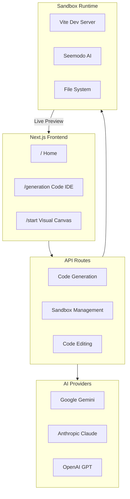

Seemodo is a full-stack AI-powered development platform that enables rapid application creation through multiple modalities. Build complete React applications in minutes, not hours.

## What is Seemodo?

Seemodo is an AI coding assistant that transforms your ideas into working applications. Whether you describe what you want in plain text, design visually on a canvas, or clone an existing website, Seemodo generates production-ready React code with Tailwind CSS styling.

<CardGroup cols={2}>
  <Card title="Text-to-App" icon="message">
    Describe what you want and get a working React application instantly.
  </Card>
  <Card title="Visual Design" icon="paintbrush">
    Use the canvas-based designer to create screens visually with tldraw.
  </Card>
  <Card title="Website Cloning" icon="clone">
    Clone any website's design instantly with Firecrawl integration.
  </Card>
  <Card title="AI Chat Editor" icon="comments">
    Iteratively refine your app through natural language conversation.
  </Card>
</CardGroup>

## Key Features

### Multi-Model AI Support

Seemodo supports multiple AI providers for maximum flexibility:

| Model | Provider | Best For |
|-------|----------|----------|
| Gemini 3 Pro | Google | Default, balanced performance |
| Claude Sonnet 4 | Anthropic | Complex reasoning |
| GPT-5 | OpenAI | General purpose |
| Kimi K2 | Groq | Fast inference |

### Live Sandbox Preview

Every generated application runs in a real sandbox environment with:

- **Hot Module Replacement (HMR)** - See changes instantly
- **Full Vite dev server** - Real development environment
- **Package management** - Auto-detect and install npm dependencies
- **Error recovery** - AI automatically fixes build errors

### Seemodo Cloud

Connect your Supabase project for full backend capabilities:

- Database management
- Authentication
- Storage
- Edge Functions
- Row Level Security policies

## Getting Started

<Steps>
  <Step title="Open Seemodo">
    Navigate to the Seemodo app at `http://app.seemodo.ai` or your deployed URL.
  </Step>
  <Step title="Enter a prompt">
    Describe what you want to build, or paste a URL to clone.
  </Step>
  <Step title="Generate">
    Click Generate and watch your app come to life in the live preview.
  </Step>
  <Step title="Iterate with AI">
    Use the AI chat to refine and extend your application.
  </Step>
</Steps>

## Architecture Overview

## Next Steps

<CardGroup cols={2}>
  <Card title="Quick Start" icon="play" href="/seemodo/getting-started">
    Set up Seemodo and generate your first app.
  </Card>
  <Card title="AI Coder Guide" icon="robot" href="/seemodo/ai-coder">
    Learn how to use the AI chat interface effectively.
  </Card>
  <Card title="Visual Designer" icon="palette" href="/seemodo/visual-designer">
    Master the canvas-based visual design tools.
  </Card>
  <Card title="Seemodo Cloud" icon="cloud" href="/seemodo/cloud">
    Connect Supabase for backend functionality.
  </Card>
</CardGroup>
