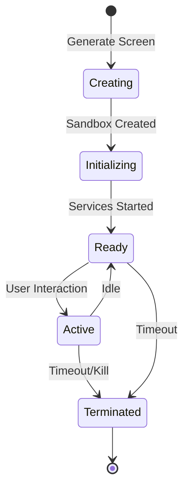
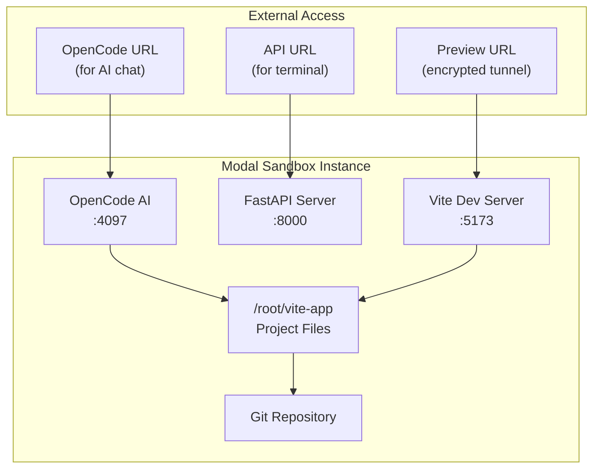

Seemodo uses cloud sandboxes to run your generated applications. Each sandbox provides a complete development environment with a Vite dev server, package management, and AI integration.

## Available Providers

<Tabs>
  <Tab title="Modal (Recommended)">
    **Fast, scalable cloud sandboxes with full AI integration**

    Modal Labs provides pre-configured sandboxes optimized for Seemodo:

    | Feature | Details |
    |---------|---------|
    | Timeout | 1-24 hours (configurable) |
    | Package Manager | pnpm |
    | AI Integration | OpenCode server included |
    | Git | Auto-commit after AI changes |
    | Preview | Encrypted tunnel URLs |

    **Included Services:**
    - Vite dev server (port 5173)
    - FastAPI server (port 8000)
    - OpenCode AI server (port 4097)

    **Setup:**
    ```bash
    cd modal-backend
    pip install modal
    modal setup
    modal deploy main.py
    ```

    Add to `.env`:
    ```env
    SANDBOX_PROVIDER=modal
    MODAL_BACKEND_URL=https://your-deployed-url.modal.run
    ```
  </Tab>
  <Tab title="E2B">
    **Secure sandboxes for code execution**

    E2B provides isolated sandboxes with full filesystem access:

    | Feature | Details |
    |---------|---------|
    | Timeout | 60 minutes |
    | Package Manager | npm |
    | AI Integration | External only |
    | Preview | Port 5173 |

    **Setup:**
    
    Get an API key from [e2b.dev](https://e2b.dev) and add to `.env`:
    ```env
    SANDBOX_PROVIDER=e2b
    E2B_API_KEY=your_e2b_api_key
    ```
  </Tab>
  <Tab title="Vercel Sandbox">
    **Native Next.js support with Vercel infrastructure**

    Optimized for Next.js applications:

    | Feature | Details |
    |---------|---------|
    | Timeout | 15 minutes |
    | Package Manager | npm |
    | Framework | Next.js native |
    | Preview | Port 3000 |

    **Setup:**
    ```env
    SANDBOX_PROVIDER=vercel
    ```

    <Note>
      Vercel Sandbox is best suited for Next.js-specific applications.
    </Note>
  </Tab>
</Tabs>

## Provider Comparison

| Feature | Modal | E2B | Vercel |
|---------|-------|-----|--------|
| Default Timeout | 1 hour | 60 min | 15 min |
| Max Timeout | 24 hours | 60 min | 15 min |
| OpenCode AI | ✅ Built-in | ❌ | ❌ |
| Git Integration | ✅ Auto-commit | ❌ | ❌ |
| Package Manager | pnpm | npm | npm |
| Startup Time | ~5 seconds | ~10 seconds | ~3 seconds |
| Best For | Full AI workflow | Quick prototypes | Next.js apps |

## Sandbox Lifecycle



### Creating a Sandbox

A sandbox is automatically created when you:

1. Generate a HiFi screen
2. Click Generate Flow with HiFi mode

The process:
1. Request new sandbox from provider
2. Wait for container startup
3. Initialize Vite dev server
4. Start OpenCode AI (Modal only)
5. Return preview URL

### Sandbox States

| State | Description |
|-------|-------------|
| **Initializing** | Sandbox is starting up |
| **Ready** | All services running, preview available |
| **Active** | User is interacting with the sandbox |
| **Idle** | No recent activity |
| **Terminated** | Sandbox has been stopped |

## Modal Sandbox Architecture



### Pre-installed Template

Modal sandboxes come with a pre-configured Vite + React + Tailwind template:

```
/root/vite-app/
├── src/
│   ├── main.jsx
│   ├── App.jsx
│   └── index.css
├── public/
├── index.html
├── package.json
├── vite.config.js
├── tailwind.config.js
└── postcss.config.js
```

## Configuration

All sandbox settings are in `config/app.config.ts`:

```typescript
export const appConfig = {
  // Modal Configuration
  modal: {
    timeoutMinutes: 60,
    backendUrl: process.env.MODAL_BACKEND_URL,
    vitePort: 5173,
    viteStartupDelay: 5000,
    workingDirectory: '/root/vite-app',
  },
  
  // E2B Configuration
  e2b: {
    timeoutMinutes: 60,
    vitePort: 5173,
    viteStartupDelay: 10000,
    workingDirectory: '/home/user/app',
  },
  
  // Vercel Configuration
  vercelSandbox: {
    timeoutMinutes: 15,
    devPort: 3000,
    devServerStartupDelay: 7000,
    workingDirectory: '/app',
  },
};
```

## Terminal Access

Open the terminal to run commands directly in the sandbox:

1. Click the **Terminal** button after a sandbox is active
2. Use the built-in terminal or AI chat

Common commands:
```bash
# View files
ls -la src/

# Install a package
pnpm add lodash

# Check for errors
cat vite.log

# View git history
git log --oneline
```

## Downloading Your Project

Export your project as a ZIP file:

1. Open the Sandbox Panel
2. Click the **Download** button
3. Receive a complete ZIP with:
   - All source files
   - `package.json` with dependencies
   - Configuration files
   - Git history (Modal only)

Run the downloaded project locally:
```bash
unzip project.zip
cd project
pnpm install
pnpm dev
```

## Troubleshooting

<AccordionGroup>
  <Accordion title="Sandbox not starting">
    - Check your provider API key/URL is correct
    - Verify the Modal backend is deployed
    - Check network connectivity
    - Look at browser console for errors
  </Accordion>
  <Accordion title="Preview not loading">
    - Wait for the Vite server to start (may take 5-10 seconds)
    - Check for build errors in the logs
    - Ensure the sandbox hasn't timed out
    - Try refreshing the preview iframe
  </Accordion>
  <Accordion title="Packages not installing">
    - Verify the package name is correct
    - Check for network issues in the sandbox
    - Use `pnpm` instead of `npm` (Modal)
    - Restart Vite after installation
  </Accordion>
  <Accordion title="AI not connecting">
    - Ensure you're using Modal provider
    - Wait for full sandbox initialization
    - Check OpenCode URL is available
    - Look for connection errors in the panel
  </Accordion>
</AccordionGroup>

## Environment Variables

Sandboxes support environment variables for:

- API keys (for external services)
- Configuration flags
- Feature toggles

Create a `.env` file in the sandbox or ask the AI to set up environment variables.

<Warning>
  Never commit real API keys to generated code. Use environment variables and `.env` files.
</Warning>
